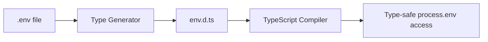

# How to Type process.env in TypeScript (Without Using 'any')

Every TypeScript project I've worked on hits this wall eventually. You're cruising along with strict mode enabled, types everywhere, feeling good about your codebase  and then you need to read an environment variable.

```typescript
const apiKey = process.env.API_KEY;
// type: string | undefined
```

That `string | undefined` is technically correct. Node.js has no way of knowing at compile time which environment variables exist. But it's also annoying, because *you* know `API_KEY` is set. You put it in your `.env` file. It's in your deployment config. It's definitely there.

So what do most people do? They reach for a type assertion or  worse  slap `as any` on it and move on. Don't do that. There's a proper way to type process.env in TypeScript, and it takes about 30 seconds to set up.

## Why `process.env` Types Are `string | undefined` by Default

Node's type definitions (from `@types/node`) define `process.env` as:

```typescript
interface ProcessEnv {
  [key: string]: string | undefined;
}
```

It's an index signature. Any key returns `string | undefined`. This is the safe default  Node can't guarantee any specific variable exists at runtime. But in your application, you usually *can* guarantee certain variables exist (or at least you should be validating that they do at startup).

The fix isn't to cast away the types. The fix is to tell TypeScript exactly which environment variables your app expects.

## How to Type process.env in TypeScript with Module Augmentation

Create a file called `env.d.ts` in your project root (or wherever your other declaration files live). Here's what goes in it:

```typescript
// env.d.ts
declare global {
  namespace NodeJS {
    interface ProcessEnv {
      NODE_ENV: "development" | "production" | "test";
      API_KEY: string;
      DATABASE_URL: string;
      NEXT_PUBLIC_APP_URL: string;
      // Add every env var your app uses
    }
  }
}

export {};
```

That `declare global` block is doing the heavy lifting here. It tells TypeScript "I'm extending the global `NodeJS.ProcessEnv` interface with these specific keys." The `export {}` at the bottom makes the file a module  without it, the `declare global` won't work correctly.

Now when you access `process.env.API_KEY`, TypeScript knows it's a `string` (not `string | undefined`). And if you typo it as `process.env.APi_KEY`, you'll get a compile error. That alone has saved me from at least two production bugs.

> **Tip:** Make sure your `tsconfig.json` includes the directory where `env.d.ts` lives. If it's in the project root and you have `"include": ["src"]`, TypeScript won't pick it up. Either move the file into `src/` or add `"env.d.ts"` to your `include` array.

### A Quick Note on `declare global` vs `declare namespace`

You might see older examples that skip `declare global` and just write `declare namespace NodeJS`. That works in `.d.ts` files that aren't modules (no imports or exports). But the `declare global` pattern is more explicit and works regardless of whether the file is a module. I'd stick with that approach  it's less likely to break if someone adds an import to the file later.

If you want to understand declaration files more deeply, check out our guide on [what TypeScript declaration files are and how they work](/blog/what-is-typescript-declaration-file).

## The Problem With Manual Type Definitions

Here's where it gets annoying. You add a new env var to your `.env` file, deploy it, wire it up in your code  and forget to update `env.d.ts`. Now you've got an untyped variable sneaking through, and the whole point of typing your env was to prevent exactly that.

On a team of five developers, this happens constantly. Someone adds `REDIS_URL` to the deployment config but nobody touches the type definition. Three weeks later, someone else typos it as `REDIS_URI` and spends an hour debugging why the cache isn't connecting.

The real solution is to generate your env types automatically from your `.env` file.



If you don't want to set up a build step for this, [SnipShift's Env to Types converter](https://snipshift.dev/env-to-types) can generate typed interfaces, Zod schemas, or even t3-env configurations from your `.env` file. Paste your env file on the left, get a type-safe definition on the right. It handles inferring types from values too  so `PORT=3000` becomes `PORT: number` instead of just `string`.

## Going Further: Runtime Validation

Compile-time types are great, but they don't protect you at runtime. If someone deploys without setting `DATABASE_URL`, TypeScript won't save you  the type says it's a `string`, but at runtime it's `undefined`.

For production apps, I'd combine the `declare global` approach with runtime validation using Zod or Valibot:

```typescript
import { z } from "zod";

const envSchema = z.object({
  NODE_ENV: z.enum(["development", "production", "test"]),
  API_KEY: z.string().min(1),
  DATABASE_URL: z.string().url(),
  PORT: z.coerce.number().default(3000),
});

// Validate at startup  fail fast if something's missing
const env = envSchema.parse(process.env);

export default env;
```

This gives you both compile-time autocomplete and runtime safety. The app crashes immediately on startup if a required variable is missing, instead of failing silently at 3am when some random function tries to read it.

> **Warning:** Don't skip runtime validation in production. Type-safe `process.env` only catches typos and missing keys at compile time  it can't verify that the actual runtime environment has the right values.

## Quick Reference

| Approach | Compile-time safety | Runtime safety | Effort |
|----------|-------------------|----------------|--------|
| Raw `process.env` | None | None | Zero |
| `as string` cast | False confidence | None | Low |
| `declare global` (env.d.ts) | Full autocomplete + error checking | None | Low |
| Zod/Valibot schema | Full (with inference) | Full validation | Medium |
| `declare global` + Zod | Full | Full | Medium |

For most projects, I'd go with the last row  `declare global` for the developer experience, plus a Zod schema that validates at startup. It's not much code, and it eliminates an entire category of "works on my machine" bugs.

If you're managing multiple environment files across different stages, our post on [managing multiple .env files](/blog/manage-multiple-env-files) covers the organizational side of this problem. And if you're running strict mode (you should be), check out our [TypeScript strict mode guide](/blog/typescript-strict-mode) for more ways to catch bugs at compile time. Need to do the same thing for browser globals like `window`? Our guide on [typing window and document in TypeScript](/blog/type-window-document-typescript) uses the same `declare global` pattern for the DOM side.

The bottom line: there's no good reason to use `any` for environment variables in 2026. Type them properly, validate them at runtime, and move on to solving actual problems. Your future self  and your teammates  will thank you.

Check out more free developer tools at [SnipShift.dev](https://snipshift.dev).
