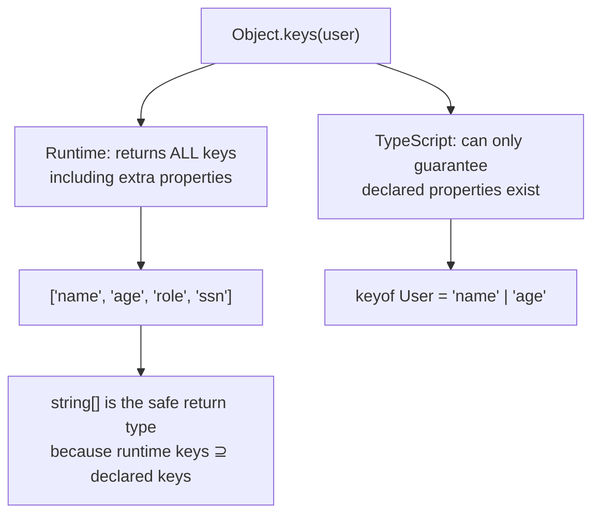

# How to Create a Type-Safe Object.keys() in TypeScript

If you've used TypeScript for more than a week, you've hit this. You call `Object.keys()` on an object with known properties, and instead of getting `("name" | "age" | "email")[]`, you get `string[]`. You try to use those keys to index back into the object, and TypeScript yells at you.

```typescript
const user = { name: "Alice", age: 30, email: "alice@example.com" };

const keys = Object.keys(user);
// Type: string[]  NOT ("name" | "age" | "email")[]

keys.forEach((key) => {
  console.log(user[key]);
  //               ^^^^ Element implicitly has an 'any' type because
  //                    expression of type 'string' can't be used to
  //                    index type '{ name: string; age: number; email: string; }'
});
```

This feels broken. But it's actually intentional  and understanding *why* makes you a better TypeScript developer.

## Why Object.keys() Returns string[]

Here's the thing that confused me for years: TypeScript's type system is **structural**, not nominal. That means any object that has *at least* the required properties satisfies a type  but it can also have *extra* properties that the type doesn't know about.

```typescript
interface User {
  name: string;
  age: number;
}

function printUser(user: User) {
  // user might have MORE properties than just name and age
  const keys = Object.keys(user); // string[] is correct here!
}

// This is perfectly valid:
const extendedUser = { name: "Alice", age: 30, role: "admin", ssn: "123-45-6789" };
printUser(extendedUser); // TypeScript allows this
```

If `Object.keys()` returned `(keyof User)[]`  which is `("name" | "age")[]`  and you used those keys to index into the object, you'd never access `role` or `ssn`. That sounds fine... until you realize the runtime `Object.keys()` *does* return `"role"` and `"ssn"`. The types would be lying.

TypeScript chose correctness over convenience here. `string[]` is the honest answer because at runtime, objects can always have more keys than their type says.



## The Type-Safe Wrapper

Knowing all that, there are cases where you're *sure* the object only has its declared keys  typically object literals you just created, config objects, or mapped types. For those cases, here's a typed wrapper:

```typescript
function typedKeys<T extends object>(obj: T): (keyof T)[] {
  return Object.keys(obj) as (keyof T)[];
}
```

That's it. One line. The `as` assertion is safe *when you control the object's shape*  which is most of the time in practice.

```typescript
const user = { name: "Alice", age: 30, email: "alice@example.com" };

const keys = typedKeys(user);
// Type: ("name" | "age" | "email")[]

keys.forEach((key) => {
  console.log(user[key]); // No error  key is properly typed
});
```

> **Warning:** Don't use `typedKeys` on objects that might have extra properties at runtime  function parameters, API responses before validation, or anything from external sources. The `as` cast is a promise *you're* making to TypeScript, and if it's wrong, you'll get runtime surprises with zero compiler warnings.

## Type-Safe Object.entries() Too

The same problem applies to `Object.entries()`. Here's the companion wrapper:

```typescript
function typedEntries<T extends object>(obj: T): [keyof T, T[keyof T]][] {
  return Object.entries(obj) as [keyof T, T[keyof T]][];
}

const user = { name: "Alice", age: 30, email: "alice@example.com" };

typedEntries(user).forEach(([key, value]) => {
  // key: "name" | "age" | "email"
  // value: string | number
  console.log(`${String(key)}: ${value}`);
});
```

One caveat: the `value` type is `T[keyof T]`  which is the *union* of all value types. So for our user, `value` is `string | number`, not the specific type for each key. TypeScript can't narrow that further without a conditional check. It's still way better than `any`, though.

## Record Iteration Patterns

If you're working with `Record` types, iteration is cleaner because the key type is already known:

```typescript
const scores: Record<"math" | "science" | "english", number> = {
  math: 95,
  science: 88,
  english: 92,
};

// Object.keys still returns string[], but you can assert safely
const subjects = Object.keys(scores) as (keyof typeof scores)[];

subjects.forEach((subject) => {
  console.log(`${subject}: ${scores[subject]}`); // works
});
```

Or use the `typedKeys` helper:

```typescript
typedKeys(scores).forEach((subject) => {
  // subject: "math" | "science" | "english"  no assertion needed at call site
  console.log(`${subject}: ${scores[subject]}`);
});
```

For mapped types and Record-heavy code, I keep `typedKeys` and `typedEntries` in a shared utils file. They're tiny, but they eliminate a whole class of type errors.

## The for...in Alternative

JavaScript's `for...in` loop has the same issue  the loop variable is typed as `string`:

```typescript
const config = { host: "localhost", port: 3000, debug: true };

for (const key in config) {
  // key is string, not keyof typeof config
  console.log(config[key]); // Error
}
```

The fix is a type annotation in the loop  but TypeScript won't let you annotate `for...in` variables directly. So you need an intermediate assertion:

```typescript
for (const key in config) {
  const k = key as keyof typeof config;
  console.log(config[k]); // works
}
```

Or just use `typedKeys` with `forEach`, which reads better anyway:

```typescript
typedKeys(config).forEach((key) => {
  console.log(config[key]); // clean, no inline assertions
});
```

## When to Use Each Approach

| Scenario | Approach |
|---|---|
| Object literal you just created | `typedKeys()`  safe, you control the shape |
| Config objects with known keys | `typedKeys()`  the keys won't surprise you |
| Function parameter (unknown extras) | `Object.keys()` returning `string[]`  correct behavior |
| API response (unvalidated) | Validate with Zod first, then `typedKeys()` on the validated result |
| Record<K, V> iteration | `typedKeys()` or cast `as (keyof typeof obj)[]` |
| Generic function over unknown T | Stick with `string[]`  you can't guarantee key completeness |

The rule I follow: if you *created* the object in the same scope (or validated it), `typedKeys` is safe. If the object came from somewhere else and could have extra keys, let TypeScript's `string[]` protect you.

## A Quick Note on Performance

`typedKeys` is literally just `Object.keys()` with a type cast. There's zero runtime overhead  the `as` assertion is erased during compilation. So there's no reason to avoid it for performance. The only risk is type-level: if you use it on objects with unknown shapes, you're lying to the compiler.

If you're migrating a JavaScript project and finding dozens of `Object.keys()` indexing errors as you add types, [SnipShift's JS to TypeScript converter](https://snipshift.dev/js-to-ts) can help you identify where these patterns appear and suggest proper typing. But for the `Object.keys()` issue specifically, now you know the fix  and more importantly, you know *why* it's needed.

For more TypeScript utility patterns, check out our [TypeScript cheatsheet](/blog/typescript-cheatsheet) or the guide on [keyof and indexed access types](/blog/typescript-keyof-explained). And if you've been bitten by the related `Object.entries()` frustration, our [interface vs type](/blog/typescript-interface-vs-type) guide covers the structural typing fundamentals that explain all of this behavior.

One utility function, one `as` cast, and a whole category of TypeScript frustration  gone.
