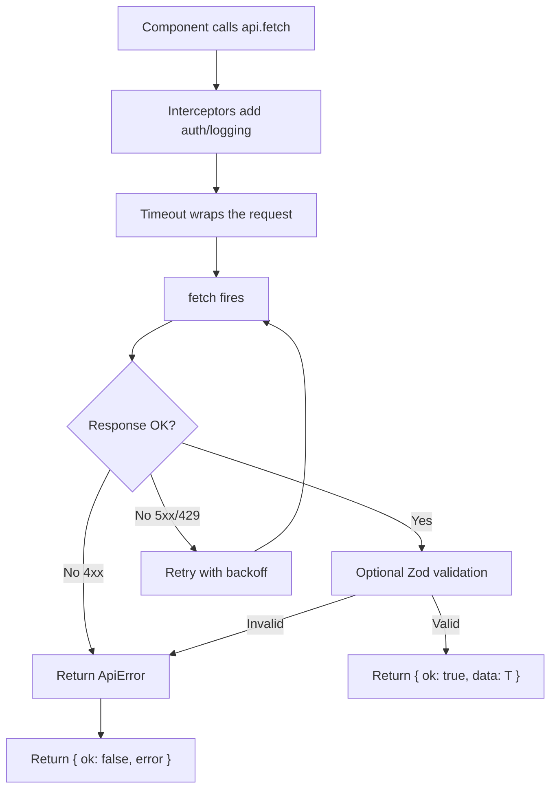

# How to Type a Fetch Wrapper That Works with Any API

Every TypeScript project I've worked on eventually grows a fetch wrapper. It starts with a simple `fetchJSON` function. Then someone adds error handling. Then timeout support. Then retries. Before long you've got 200 lines of untyped spaghetti that everyone's afraid to touch.

I've written this wrapper at least five times across different projects, and I've finally settled on a pattern that's generic enough to work with any API, type-safe end to end, and simple enough that the types don't become the problem. Here's the version I keep copying into new projects.

## The Core: A Generic Fetch Function

The foundation is a function that takes a URL, makes a request, and returns a typed response. The generic parameter `T` is what makes it reusable:

```typescript
// lib/api-client.ts

type HttpMethod = 'GET' | 'POST' | 'PUT' | 'PATCH' | 'DELETE';

interface RequestConfig {
  method?: HttpMethod;
  headers?: Record<string, string>;
  body?: unknown;
  signal?: AbortSignal;
}

interface ApiResponse<T> {
  data: T;
  status: number;
  headers: Headers;
}

interface ApiError {
  message: string;
  status: number;
  code?: string;
}

type ApiResult<T> = { ok: true; data: T; status: number } | { ok: false; error: ApiError };

async function apiFetch<T>(
  url: string,
  config: RequestConfig = {}
): Promise<ApiResult<T>> {
  const { method = 'GET', headers = {}, body, signal } = config;

  try {
    const response = await fetch(url, {
      method,
      headers: {
        'Content-Type': 'application/json',
        ...headers,
      },
      body: body ? JSON.stringify(body) : undefined,
      signal,
    });

    if (!response.ok) {
      const errorBody = await response.json().catch(() => ({}));
      return {
        ok: false,
        error: {
          message: errorBody.message ?? response.statusText,
          status: response.status,
          code: errorBody.code,
        },
      };
    }

    const data = (await response.json()) as T;
    return { ok: true, data, status: response.status };
  } catch (err) {
    // Network errors, timeouts, aborted requests
    return {
      ok: false,
      error: {
        message: err instanceof Error ? err.message : 'Unknown error',
        status: 0,
        code: 'NETWORK_ERROR',
      },
    };
  }
}
```

The `ApiResult<T>` return type is a discriminated union. When you check `result.ok`, TypeScript narrows the type  you either have `data: T` or `error: ApiError`. No more `data | undefined` gymnastics.

```typescript
const result = await apiFetch<User[]>('/api/users');

if (result.ok) {
  // TypeScript knows result.data is User[]
  console.log(result.data[0].name);
} else {
  // TypeScript knows result.error is ApiError
  console.error(result.error.message);
}
```

If you're not comfortable with how generics flow through function calls, our [TypeScript generics guide](/blog/typescript-generics-explained) explains the mechanics behind this pattern.

## Adding Zod Response Parsing

The generic `as T` cast above works, but it's a lie. TypeScript trusts you, but the API might return something different at runtime. For critical endpoints, validate the response with Zod:

```typescript
import { z, ZodSchema } from 'zod';

async function apiFetchValidated<T>(
  url: string,
  schema: ZodSchema<T>,
  config: RequestConfig = {}
): Promise<ApiResult<T>> {
  const result = await apiFetch<unknown>(url, config);

  if (!result.ok) return result;

  const parsed = schema.safeParse(result.data);
  if (!parsed.success) {
    return {
      ok: false,
      error: {
        message: 'Response validation failed',
        status: result.status,
        code: 'VALIDATION_ERROR',
      },
    };
  }

  return { ok: true, data: parsed.data, status: result.status };
}

// Usage
const UserSchema = z.object({
  id: z.string(),
  name: z.string(),
  email: z.string().email(),
});

const result = await apiFetchValidated(
  '/api/users/123',
  UserSchema
);
// result.data is now validated AND typed  not just cast
```

I don't use `apiFetchValidated` for every request  that would be overkill. I use it for external APIs (where I don't control the contract) and for critical paths where data integrity matters more than a few extra milliseconds.

## Timeout Handling

The native `fetch` API doesn't have a timeout option. You have to use `AbortController`:

```typescript
function withTimeout(ms: number): { signal: AbortSignal; clear: () => void } {
  const controller = new AbortController();
  const timeoutId = setTimeout(() => controller.abort(), ms);
  return {
    signal: controller.signal,
    clear: () => clearTimeout(timeoutId),
  };
}

// Usage
const timeout = withTimeout(5000); // 5 second timeout
const result = await apiFetch<User>('/api/users/123', {
  signal: timeout.signal,
});
timeout.clear();

if (!result.ok && result.error.code === 'NETWORK_ERROR') {
  // Could be a timeout  check the message
  console.error('Request timed out or failed:', result.error.message);
}
```

Wrap this into the client for convenience:

```typescript
async function apiFetchWithTimeout<T>(
  url: string,
  config: RequestConfig & { timeout?: number } = {}
): Promise<ApiResult<T>> {
  const { timeout: ms = 10_000, ...rest } = config;
  const { signal, clear } = withTimeout(ms);

  try {
    return await apiFetch<T>(url, { ...rest, signal });
  } finally {
    clear();
  }
}
```

## Retry Logic

Some requests are worth retrying  transient network failures, 429 rate limits, 503 server errors. Here's a retry wrapper that handles backoff:

```typescript
async function apiFetchWithRetry<T>(
  url: string,
  config: RequestConfig & { retries?: number; retryDelay?: number } = {}
): Promise<ApiResult<T>> {
  const { retries = 3, retryDelay = 1000, ...rest } = config;

  for (let attempt = 0; attempt <= retries; attempt++) {
    const result = await apiFetch<T>(url, rest);

    if (result.ok) return result;

    // Don't retry client errors (4xx) except 429
    const { status } = result.error;
    if (status >= 400 && status < 500 && status !== 429) {
      return result;
    }

    // Don't retry on last attempt
    if (attempt === retries) return result;

    // Exponential backoff: 1s, 2s, 4s
    const delay = retryDelay * 2 ** attempt;
    await new Promise((resolve) => setTimeout(resolve, delay));
  }

  // TypeScript needs this  the loop always returns, but TS doesn't know that
  throw new Error('Unreachable');
}
```

> **Tip:** For 429 responses, check the `Retry-After` header instead of using your own backoff. The server is telling you exactly when to retry.

## Interceptor Pattern

If you need to add auth headers to every request, log requests, or transform responses globally, an interceptor pattern keeps things clean:

```typescript
type Interceptor = (config: RequestConfig & { url: string }) => RequestConfig & { url: string };

function createApiClient(baseUrl: string, interceptors: Interceptor[] = []) {
  return {
    async fetch<T>(path: string, config: RequestConfig = {}): Promise<ApiResult<T>> {
      let fullConfig = { ...config, url: `${baseUrl}${path}` };

      // Apply interceptors
      for (const interceptor of interceptors) {
        fullConfig = interceptor(fullConfig);
      }

      const { url, ...rest } = fullConfig;
      return apiFetch<T>(url, rest);
    },
  };
}

// Usage
const api = createApiClient('https://api.example.com', [
  // Auth interceptor
  (config) => ({
    ...config,
    headers: {
      ...config.headers,
      Authorization: `Bearer ${getToken()}`,
    },
  }),
  // Logging interceptor
  (config) => {
    console.log(`${config.method ?? 'GET'} ${config.url}`);
    return config;
  },
]);

const result = await api.fetch<User[]>('/users');
```

This is similar to what Axios does with interceptors, but you own all the code and the types are transparent. No magic, no library-specific abstractions.

## The Full Pattern

Here's how all these pieces fit together in a real project:



If you're working with cURL commands and want to quickly convert them to typed fetch calls, [SnipShift's cURL to Code converter](https://snipshift.dev/curl-to-code) can generate the fetch call for you  then you just wrap it with the patterns from this post.

## A Note on When to Use This vs a Library

You might wonder: why not just use Axios, or ky, or ofetch?

Honestly, those are fine choices. If you're on a team that's already using Axios, don't rip it out to build a custom wrapper. But there are a few reasons I prefer the hand-rolled approach:

- **Bundle size**: A custom wrapper is ~50 lines. Axios is ~13KB min+gzip. For edge functions and workers, that matters.
- **Type transparency**: You control every type. No guessing what `AxiosResponse<T>` does internally.
- **No dependencies**: One fewer package to maintain, audit, and keep updated.
- **Education**: Understanding how fetch works without abstractions makes you better at debugging HTTP issues.

If you need advanced features like HTTP/2 multiplexing or automatic content negotiation, reach for a library. For everything else, a **typed fetch wrapper in TypeScript** like this one covers it.

For more context on handling API errors on the frontend  the other half of this pattern  our [API error handling guide](/blog/handle-api-errors-javascript) covers what to do with those `ApiError` objects once you have them. And if you're typing responses from specific APIs, our guide on [typing Axios response data](/blog/type-axios-response-data-typescript) applies the same principles to Axios-based projects.

Copy this pattern, adapt it to your project, and you'll never write an untyped `fetch` call again. The types are the documentation, the validation is the safety net, and the whole thing fits in one file.
