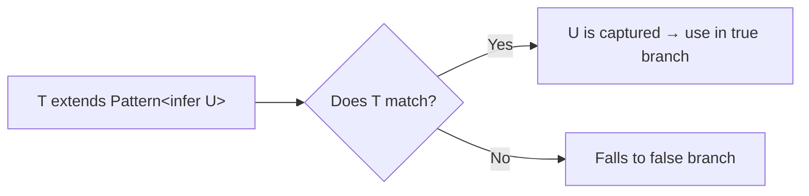

# TypeScript Conditional Types: A Practical Guide (Not the Academic One)

Most explanations of TypeScript conditional types start with the theory  extends, infer, distributive behavior, blah blah blah. And by the time you get to an actual use case, you've already zoned out.

I'm going to do this backwards. I'll show you patterns you'll actually use, and explain the mechanics as we go. If you've used ternary operators in JavaScript, you already understand the syntax. The rest is just knowing when to reach for it.

## The Basics in 30 Seconds

A conditional type looks like a ternary:

```typescript
type IsString<T> = T extends string ? "yes" : "no";

type A = IsString<string>;  // "yes"
type B = IsString<number>;  // "no"
type C = IsString<"hello">; // "yes"  string literals extend string
```

`T extends string` isn't checking equality  it's checking assignability. Can `T` be assigned to `string`? If yes, the type resolves to the first branch. If no, the second.

That's the whole syntax. Now let's use it for something real.

## Pattern 1: Unwrapping Promises

You have a function that returns a promise, and you want to get the type of the resolved value. This comes up all the time with async code.

```typescript
type UnwrapPromise<T> = T extends Promise<infer U> ? U : T;

type A = UnwrapPromise<Promise<string>>;     // string
type B = UnwrapPromise<Promise<number[]>>;   // number[]
type C = UnwrapPromise<string>;              // string  not a promise, returns as-is
```

The `infer` keyword is doing the heavy lifting here. It says: "If `T` matches `Promise<something>`, capture that `something` as `U`." It's like a regex capture group, but for types.

You'll see this pattern in real codebases when working with utility types around async operations:

```typescript
type ApiReturnType<T extends (...args: any[]) => any> =
  UnwrapPromise<ReturnType<T>>;

async function fetchUsers(): Promise<User[]> {
  return []; // imagine a real API call
}

type Users = ApiReturnType<typeof fetchUsers>; // User[]
```

TypeScript actually ships a built-in `Awaited<T>` type that does this (and handles nested promises), but understanding how to build it yourself is the point. Once you get `infer`, you can build custom versions for any wrapper type.

## Pattern 2: Extracting Component Props

If you're working with React, this pattern is gold. Given a component, extract its props type:

```typescript
type PropsOf<T> = T extends React.ComponentType<infer P> ? P : never;

// Given a component
const Button: React.FC<{ label: string; onClick: () => void }> = (props) => {
  return null; // simplified
};

type ButtonProps = PropsOf<typeof Button>; // { label: string; onClick: () => void }
```

React already has `React.ComponentProps<typeof Button>` for this, but the conditional type version works with any wrapper pattern  not just React components. Same `infer` mechanic: "If `T` matches `ComponentType<something>`, give me that `something`."

Here's a more practical variant  extracting the type from an array:

```typescript
type ElementOf<T> = T extends (infer E)[] ? E : never;

type A = ElementOf<string[]>;   // string
type B = ElementOf<number[]>;   // number
type C = ElementOf<User[]>;     // User
type D = ElementOf<string>;     // never  not an array
```

## Pattern 3: Filtering Union Members

This is where conditional types really shine, because of a behavior called **distribution**. When you apply a conditional type to a union, TypeScript applies it to *each member separately* and collects the results.

```typescript
type OnlyStrings<T> = T extends string ? T : never;

type Mixed = string | number | "hello" | boolean | "world";
type Result = OnlyStrings<Mixed>; // string | "hello" | "world"
```

Wait  why did `string`, `"hello"`, and `"world"` survive but `number` and `boolean` didn't? Because TypeScript checked each union member:

- `string extends string?` → yes → keep `string`
- `number extends string?` → no → `never`
- `"hello" extends string?` → yes → keep `"hello"`
- `boolean extends string?` → no → `never`
- `"world" extends string?` → yes → keep `"world"`

Then it unions the results. `never` in a union disappears. This is the distribution behavior, and it's incredibly powerful for filtering.

TypeScript has a built-in version of this: `Extract<T, U>` and `Exclude<T, U>`.

```typescript
type Primitives = string | number | boolean | null | undefined;

type Nullable = Extract<Primitives, null | undefined>;    // null | undefined
type NonNull = Exclude<Primitives, null | undefined>;     // string | number | boolean
```

But you can build custom filters for anything:

```typescript
type EventMap = {
  click: { x: number; y: number };
  keydown: { key: string };
  scroll: { offset: number };
  resize: { width: number; height: number };
};

// Extract only events whose payload has a specific property
type EventsWithCoordinates = {
  [K in keyof EventMap]: EventMap[K] extends { x: number } ? K : never;
}[keyof EventMap];

// Result: "click"
```

## Pattern 4: Conditional Return Types

This is the pattern that convinced me conditional types are worth learning. You can make a function's return type depend on its input type:

```typescript
type ParseResult<T> = T extends string
  ? number
  : T extends number
  ? string
  : never;

function convert<T extends string | number>(value: T): ParseResult<T> {
  if (typeof value === "string") {
    return parseFloat(value) as ParseResult<T>;
  }
  return String(value) as ParseResult<T>;
}

const a = convert("42");   // number
const b = convert(42);     // string
```

The function returns `number` when you pass a `string`, and `string` when you pass a `number`. TypeScript infers the correct return type at each call site. This is much better than using overloads for simple cases.

> **Tip:** If your function has more than 3-4 conditional branches in its return type, consider using [discriminated unions](/blog/typescript-discriminated-unions-pattern) instead. Conditional types are great for simple mappings, but they get unreadable fast.

## Pattern 5: Making Types Non-Nullable

A simple but common pattern  stripping `null` and `undefined` from a type:

```typescript
type NonNullable<T> = T extends null | undefined ? never : T;

type A = NonNullable<string | null>;           // string
type B = NonNullable<number | undefined>;      // number
type C = NonNullable<string | null | undefined>; // string
```

This is actually a built-in TypeScript utility type  `NonNullable<T>`. But knowing it's just a one-line conditional type demystifies it. All the utility types in TypeScript are built from these same primitives.

## The `infer` Keyword: A Deeper Look

`infer` can appear anywhere inside the `extends` clause. Here are some useful positions:

```typescript
// Extract function parameter type
type FirstParam<T> = T extends (first: infer P, ...args: any[]) => any ? P : never;

type A = FirstParam<(name: string, age: number) => void>; // string

// Extract return type (this is how ReturnType<T> works)
type MyReturnType<T> = T extends (...args: any[]) => infer R ? R : never;

type B = MyReturnType<() => boolean>; // boolean

// Extract the type from a Map
type MapValue<T> = T extends Map<any, infer V> ? V : never;

type C = MapValue<Map<string, User>>; // User
```

The key insight: `infer` creates a type variable that TypeScript fills in by pattern matching. Think of it as destructuring, but for types.



## Distributive Conditional Types: The Gotcha

There's one behavior that catches people off guard. Conditional types **distribute over unions**  but only when the checked type is a **naked type parameter**.

```typescript
type Wrapped<T> = T extends string ? "yes" : "no";

// Distributes  checks each member separately
type A = Wrapped<string | number>; // "yes" | "no"

// Does NOT distribute  T is wrapped in a tuple
type Wrapped2<T> = [T] extends [string] ? "yes" : "no";

type B = Wrapped2<string | number>; // "no"  checks the union as a whole
```

In `Wrapped`, TypeScript checks `string extends string? → yes` and `number extends string? → no`, giving you `"yes" | "no"`.

In `Wrapped2`, the `[T]` wrapping prevents distribution. TypeScript checks `[string | number] extends [string]?`  which is `no`, because the union as a whole isn't assignable to `string`.

This is the most confusing part of conditional types, and honestly, you won't need to think about it often. But when you get unexpected union results, this is probably why. Wrapping in a tuple is the standard way to disable distribution when you don't want it.

## Practical Cheat Sheet

| What You Want | Conditional Type | Built-in? |
|--------------|-----------------|:---------:|
| Unwrap a Promise | `T extends Promise<infer U> ? U : T` | `Awaited<T>` |
| Extract array element | `T extends (infer E)[] ? E : never` | No |
| Get function return | `T extends (...) => infer R ? R : never` | `ReturnType<T>` |
| Get function params | `T extends (...args: infer P) => any ? P : never` | `Parameters<T>` |
| Filter union members | `T extends U ? T : never` | `Extract<T, U>` |
| Exclude union members | `T extends U ? never : T` | `Exclude<T, U>` |
| Remove null/undefined | `T extends null \| undefined ? never : T` | `NonNullable<T>` |
| Get constructor params | `T extends new (...args: infer P) => any ? P : never` | `ConstructorParameters<T>` |

## When to Use Conditional Types (and When Not To)

Reach for conditional types when:

- You need to **transform** one type into another based on its structure
- You need to **extract** a piece from a complex type (promise contents, function params, etc.)
- You need to **filter** union members by some criteria
- You're building a **library** with generic APIs that need smart return types

Don't reach for conditional types when:

- A simple generic with constraints does the job
- The type logic has more than 3 levels of nesting  at that point, break it into smaller named types
- You're the only consumer of the type and an explicit annotation would be clearer

I've seen people write conditional types that are 15 lines long with nested `infer` clauses. That's not clever  it's unmaintainable. If you wouldn't write a 15-line ternary in JavaScript, don't do it in the type system either.

For more on the building blocks that make conditional types useful, check out our guides on [TypeScript generics](/blog/typescript-generics-explained) and the [keyof operator](/blog/typescript-keyof-explained). And if you're building these types for a codebase that's still partly JavaScript, [SnipShift's converter](https://snipshift.dev/js-to-ts) can help you get the initial types in place so you have something to build on.
