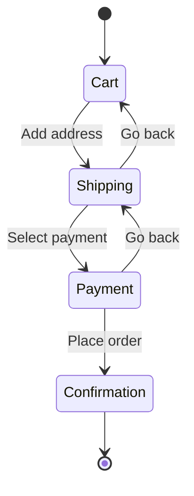

# TypeScript Discriminated Unions: The Pattern That Replaces If/Else Chains

There's a pattern in TypeScript that, once you learn it, completely changes how you model data. I'm not exaggerating  I use it in almost every project now, and it's made entire categories of bugs impossible. It's called **discriminated unions** (sometimes called "tagged unions"), and it's the single most underused feature in TypeScript codebases I review.

If you've ever written a function with a chain of `if/else` checks like this:

```typescript
function handleResponse(response: any) {
  if (response.status === "success") {
    console.log(response.data);
  } else if (response.status === "error") {
    console.log(response.error.message);
  } else if (response.status === "loading") {
    console.log("Loading...");
  }
}
```

Then you already have an intuition for what discriminated unions do. They just make it *type-safe*.

## What Is a Discriminated Union?

A discriminated union is a union type where every member has a common property  the **discriminant** (or "tag")  that TypeScript can use to narrow the type. Each value of the discriminant maps to a specific shape.

```typescript
type ApiResponse =
  | { status: "success"; data: string[] }
  | { status: "error"; error: { code: number; message: string } }
  | { status: "loading" };
```

Three things make this work:

1. **Common property**: Every member has `status`
2. **Literal types**: The `status` values are string literals, not just `string`
3. **Unique shapes**: Each status value has its own data shape

Now when you check `status`, TypeScript automatically narrows the type:

```typescript
function handleResponse(response: ApiResponse) {
  if (response.status === "success") {
    // TypeScript knows: { status: "success"; data: string[] }
    console.log(response.data); // string[]  fully typed
  } else if (response.status === "error") {
    // TypeScript knows: { status: "error"; error: { code: number; message: string } }
    console.log(response.error.message); // string  fully typed
  } else {
    // TypeScript knows: { status: "loading" }
    console.log("Loading...");
  }
}
```

No type assertions. No `as any`. No guessing. TypeScript figures out the exact shape based on the discriminant.

## The Exhaustive Switch: Your Safety Net

Here's where it gets really powerful. Instead of `if/else`, use a `switch` statement  and then add an exhaustiveness check using the `never` type:

```typescript
function handleResponse(response: ApiResponse): string {
  switch (response.status) {
    case "success":
      return `Got ${response.data.length} items`;
    case "error":
      return `Error ${response.error.code}: ${response.error.message}`;
    case "loading":
      return "Loading...";
    default: {
      // This ensures all cases are handled
      const _exhaustive: never = response;
      return _exhaustive;
    }
  }
}
```

The `never` trick works because if all union members are handled in the `case` statements, the `default` branch is unreachable  and the type of `response` in that branch is `never`. But if you add a new status to `ApiResponse` and forget to handle it, TypeScript will throw an error at the `_exhaustive` assignment. It *forces* you to update the switch.

This is huge. In a big codebase, adding a new state is always scary because you don't know how many places need updating. With exhaustive switches, TypeScript tells you every single one.

## Real Example 1: API Response States

This is the most common use case, and it's the one that probably convinced me to start using discriminated unions everywhere.

```typescript
type RequestState<T> =
  | { status: "idle" }
  | { status: "loading" }
  | { status: "success"; data: T }
  | { status: "error"; error: Error };
```

Notice the generic  you can reuse this for any data type. Here's how it looks in a React-ish context:

```typescript
function renderUsers(state: RequestState<User[]>) {
  switch (state.status) {
    case "idle":
      return "Click to load users";
    case "loading":
      return "Loading...";
    case "success":
      return state.data.map(u => u.name).join(", ");
    case "error":
      return `Failed: ${state.error.message}`;
  }
}
```

Every case is type-safe. You can't accidentally access `state.data` in the loading state  it doesn't exist there, and TypeScript knows it.

> **Tip:** If you're converting JavaScript components to TypeScript, this pattern replaces the classic `if (data && !loading && !error)` chains that are fragile and easy to get wrong. [SnipShift's JS to TypeScript converter](https://snipshift.dev/js-to-ts) can handle the initial conversion, and then you can refactor toward discriminated unions for cleaner state management.

## Real Example 2: State Machines

Discriminated unions are perfect for modeling state machines. Here's a checkout flow:

```typescript
type CheckoutState =
  | { step: "cart"; items: CartItem[] }
  | { step: "shipping"; items: CartItem[]; address: Address }
  | { step: "payment"; items: CartItem[]; address: Address; paymentMethod: PaymentMethod }
  | { step: "confirmation"; orderId: string };
```

Each step carries exactly the data it needs  no more, no less. The `cart` step doesn't have an `address` because the user hasn't entered one yet. The `confirmation` step has an `orderId` but doesn't carry the full cart around anymore.



And the transition function enforces the rules:

```typescript
function advanceCheckout(state: CheckoutState): CheckoutState {
  switch (state.step) {
    case "cart":
      return {
        step: "shipping",
        items: state.items,
        address: getDefaultAddress(),
      };
    case "shipping":
      return {
        step: "payment",
        items: state.items,
        address: state.address,
        paymentMethod: getDefaultPayment(),
      };
    case "payment":
      return {
        step: "confirmation",
        orderId: submitOrder(state),
      };
    case "confirmation":
      // Can't advance past confirmation
      return state;
  }
}
```

Try accessing `state.orderId` in the `cart` case. TypeScript won't let you. That's the kind of safety that prevents real bugs  the kind where someone accidentally reads shipping data before the user has entered it.

## Real Example 3: Form Field Types

Forms are another place where discriminated unions clean up messy code. Instead of one big "field" type with a bunch of optional properties:

```typescript
// Before: messy, error-prone
interface FormField {
  type: string;
  label: string;
  options?: string[];    // Only for select/radio
  min?: number;          // Only for number
  max?: number;          // Only for number
  pattern?: string;      // Only for text
  multiple?: boolean;    // Only for select
}
```

You end up with a type where every field is sort of optional and nothing is enforced. Discriminated unions fix this:

```typescript
// After: precise, self-documenting
type FormField =
  | { type: "text"; label: string; pattern?: string; placeholder?: string }
  | { type: "number"; label: string; min: number; max: number }
  | { type: "select"; label: string; options: string[]; multiple: boolean }
  | { type: "checkbox"; label: string; defaultChecked: boolean }
  | { type: "date"; label: string; minDate?: string; maxDate?: string };
```

Now each field type carries *exactly* the properties it needs. A `select` field always has `options`. A `number` field always has `min` and `max`. And you can write a renderer that's fully type-safe:

```typescript
function renderField(field: FormField) {
  switch (field.type) {
    case "text":
      return `<input type="text" pattern="${field.pattern ?? ""}" />`;
    case "number":
      return `<input type="number" min="${field.min}" max="${field.max}" />`;
    case "select":
      return field.options.map(o => `<option>${o}</option>`).join("");
    case "checkbox":
      return `<input type="checkbox" ${field.defaultChecked ? "checked" : ""} />`;
    case "date":
      return `<input type="date" />`;
  }
}
```

## The `never` Safety Pattern in Detail

I want to come back to the exhaustiveness check because it's so important. Here's a utility function I include in every project:

```typescript
function assertNever(value: never, message?: string): never {
  throw new Error(message ?? `Unexpected value: ${JSON.stringify(value)}`);
}
```

Use it in your default cases:

```typescript
function getFieldLabel(field: FormField): string {
  switch (field.type) {
    case "text":
      return "Text input";
    case "number":
      return "Number input";
    case "select":
      return "Dropdown";
    case "checkbox":
      return "Checkbox";
    case "date":
      return "Date picker";
    default:
      return assertNever(field);
  }
}
```

If you later add `{ type: "textarea"; ... }` to the `FormField` union and forget to handle it here, TypeScript will give you a compile error:

```
Argument of type '{ type: "textarea"; label: string; rows: number; }' is not assignable to parameter of type 'never'.
```

This turns "forgot to handle a new case" from a runtime bug into a compile-time error. In a codebase with dozens of switch statements over the same union, that's genuinely life-changing.

## When to Use Discriminated Unions

| Use Case | Why It Works |
|----------|-------------|
| API response states | Each state has different available data |
| State machines / workflows | Each step has step-specific context |
| Form field types | Different fields need different config |
| Action/event systems | Each action has a unique payload shape |
| Result/Error types | Success and failure carry different data |
| UI component variants | Each variant has variant-specific props |

## Common Mistakes

**Using `string` instead of literal types for the discriminant:**

```typescript
// Bad  'string' is too wide for narrowing
type Result =
  | { type: string; data: unknown }
  | { type: string; error: Error };

// Good  literal types enable narrowing
type Result =
  | { type: "success"; data: unknown }
  | { type: "error"; error: Error };
```

**Forgetting to make the discriminant required on all members:**

```typescript
// Bad  'type' is optional on one member
type Shape =
  | { type: "circle"; radius: number }
  | { color: string }; // No 'type'  can't discriminate!
```

**Using different property names as discriminants:**

```typescript
// Bad  different tag names
type Event =
  | { kind: "click"; x: number }
  | { type: "hover"; y: number }; // 'type' vs 'kind'  no common discriminant
```

Pick one tag name and stick with it. I usually use `type`, `kind`, or `status` depending on the domain.

## Why Not Just Use If/Else?

You can get away with `if/else` chains for small cases. But discriminated unions give you three things `if/else` doesn't:

1. **Exhaustiveness checking**  TypeScript catches unhandled cases at compile time
2. **Type narrowing**  you get the exact type in each branch, no casting
3. **Self-documenting code**  the union type itself describes all possible states

I've worked on codebases where someone added a new API response status and forgot to handle it in two of the fifteen places that consumed it. With discriminated unions and exhaustive switches, the TypeScript compiler would have flagged all fifteen. Without them, it was a production bug.

That's the kind of thing that makes you a believer.

For more on getting your types precise, check out our guides on [TypeScript generics](/blog/typescript-generics-explained) and [conditional types](/blog/typescript-conditional-types-practical). And if you're building union types from existing JavaScript code, [SnipShift's converter](https://snipshift.dev/js-to-ts) can help you generate the initial type definitions to work from.
