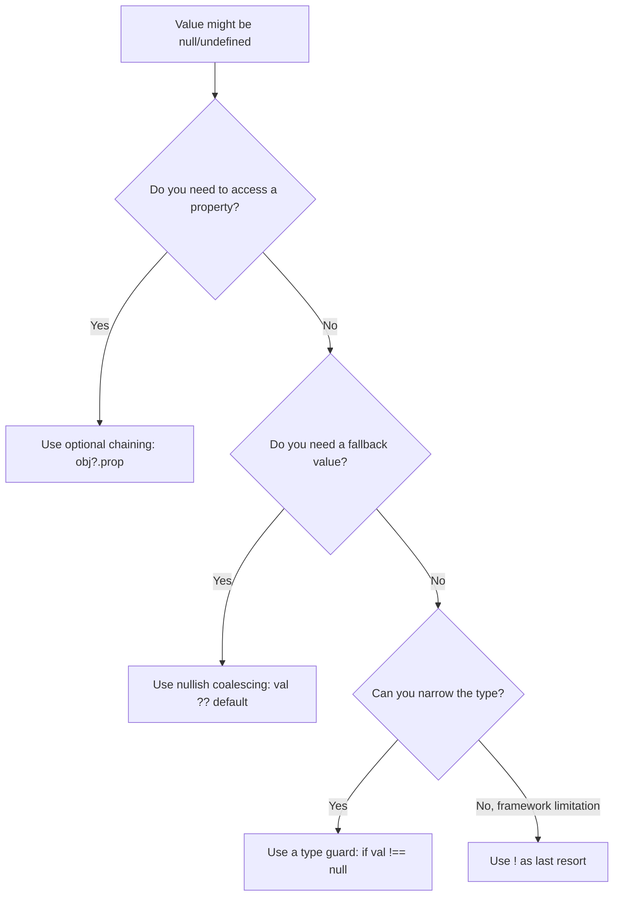

# What Does the Exclamation Mark Do in TypeScript?

You're reading through a TypeScript codebase  maybe one you just inherited  and you keep seeing this little `!` popping up after variable names. It looks like the code is yelling at you. Something like `user!.name` or `document.getElementById("app")!`.

What is that thing? And more importantly, should *you* be using it?

That `!` is called the **non-null assertion operator**, and it's one of the most misunderstood  and most abused  features in TypeScript. I've seen it silently cause production bugs on more than one team I've worked with. So let's break down what it actually does, when it's genuinely useful, and why you probably want to reach for something else most of the time.

## The Non-Null Assertion Operator: What It Actually Does

TypeScript's type system tracks whether a value could be `null` or `undefined`. When you have strict null checks enabled (and you should  it's 2026), the compiler won't let you access properties on values that *might* be null.

```typescript
// TypeScript knows getElementById could return null
const el = document.getElementById("app");
el.textContent = "Hello"; // Error: 'el' is possibly 'null'
```

The **typescript exclamation mark** (`!`) tells the compiler: "Trust me, this value is definitely not null or undefined. Stop worrying about it."

```typescript
const el = document.getElementById("app")!;
el.textContent = "Hello"; // No error  you told TS to trust you
```

That's it. The `!` operator does absolutely nothing at runtime. It produces zero JavaScript output. It's purely a compile-time assertion that removes `null` and `undefined` from a type.

Here's the mental model: it's you overriding the compiler's judgment with your own.

## When the Exclamation Mark Is Actually Fine

There are a handful of situations where using `!` is reasonable:

**1. DOM elements you know exist**

If your HTML always has a `<div id="root">` and your script only runs after the DOM loads, using `!` on `getElementById` is pragmatic:

```typescript
// You control the HTML  this element always exists
const root = document.getElementById("root")!;
```

**2. Values that are initialized outside the constructor**

Some frameworks (Angular's `@ViewChild`, for instance) initialize properties after construction. TypeScript doesn't know that, so `!` is the standard escape hatch:

```typescript
class MyComponent {
  // Angular will set this  TypeScript just doesn't know it
  @ViewChild('myRef') myRef!: ElementRef;
}
```

**3. After a check that TypeScript can't follow**

Sometimes you've already validated a value in a way the compiler doesn't understand:

```typescript
const map = new Map<string, number>();
map.set("count", 42);

// You JUST set this key  it's definitely there
const count = map.get("count")!;
```

But honestly? Even in these cases, there's usually a safer option.

## Why the Exclamation Mark Is Dangerous

Here's the thing nobody warns you about: the `!` operator is a *lie* you're telling the compiler. And lies have consequences.

```typescript
interface User {
  name: string;
  email: string;
}

function getUser(): User | null {
  return null; // Oops  no user found
}

const user = getUser()!;
console.log(user.name); // Runtime: Cannot read property 'name' of null
```

TypeScript had your back. It *knew* that value could be null. You told it to shut up. And now you've got a runtime error  the exact kind of error TypeScript was designed to prevent.

I've seen this pattern cause real production issues. A developer adds `!` to get past a type error during development, meaning to come back and handle the null case properly. They never do. The code ships. And three weeks later, an edge case hits that path and the app crashes.

> **Warning:** Every `!` in your codebase is a potential runtime error hiding in plain sight. Treat each one as tech debt that needs justification.

## Safer Alternatives to the Non-Null Assertion

Here's a before/after showing how to replace `!` with safer patterns:

### Optional Chaining (`?.`)

```typescript
// Before: dangerous
const name = getUser()!.name;

// After: safe  returns undefined instead of crashing
const name = getUser()?.name;
```

Optional chaining is almost always what you actually want. If the value is null, you get `undefined` back instead of a thrown error. Your app keeps running.

If you're not already using optional chaining and nullish coalescing together, check out our [guide on optional chaining and nullish coalescing](/blog/optional-chaining-nullish-coalescing)  they're a powerful combo.

### Type Guards

```typescript
// Before: dangerous
function processUser(user: User | null) {
  console.log(user!.name);
}

// After: safe  TypeScript narrows the type for you
function processUser(user: User | null) {
  if (!user) {
    throw new Error("User is required");
    // or return early, or show an error UI
  }
  // TypeScript now knows user is User, not null
  console.log(user.name);
}
```

Type guards are the *right* way to handle nullable values. You're not hiding the problem  you're explicitly deciding what happens when the value is null. Maybe you throw an error. Maybe you return a default. Maybe you show a loading state. But you're making a *choice* instead of pretending the problem doesn't exist.

### The Nullish Coalescing Operator (`??`)

```typescript
// Before: dangerous
const count = map.get("count")!;

// After: safe  falls back to 0 if undefined
const count = map.get("count") ?? 0;
```



## A Real-World Refactoring Example

Let me show you a real pattern I see all the time  and how to fix it. Say you're fetching a user profile and rendering it:

```typescript
// The dangerous version  ! everywhere
async function renderProfile(userId: string) {
  const response = await fetch(`/api/users/${userId}`);
  const data = await response.json();
  const user = data.user!;

  document.getElementById("name")!.textContent = user.name!;
  document.getElementById("email")!.textContent = user.email!;
  document.getElementById("avatar")!.setAttribute("src", user.avatar!);
}
```

Five exclamation marks in one function. Five places where the app can crash silently. Here's the same thing done properly:

```typescript
// The safe version  explicit handling
async function renderProfile(userId: string) {
  const response = await fetch(`/api/users/${userId}`);

  if (!response.ok) {
    showError("Failed to load profile");
    return;
  }

  const data = await response.json();
  const user = data.user;

  if (!user) {
    showError("User not found");
    return;
  }

  const nameEl = document.getElementById("name");
  const emailEl = document.getElementById("email");
  const avatarEl = document.getElementById("avatar");

  if (nameEl) nameEl.textContent = user.name ?? "Anonymous";
  if (emailEl) emailEl.textContent = user.email ?? "No email";
  if (avatarEl) avatarEl.setAttribute("src", user.avatar ?? "/default.png");
}
```

More code? Sure. But every edge case is handled. No surprises at 3am when someone hits a deleted user's profile page.

If you're converting a JavaScript codebase to TypeScript and finding yourself tempted to sprinkle `!` everywhere just to get things compiling, [SnipShift's JS to TypeScript converter](https://snipshift.dev/js-to-ts) can help  it generates proper types and handles nullable values with actual type guards instead of non-null assertions.

## When to Audit Your Codebase

If you're working on a TypeScript project, try this: search your codebase for `!.` and `!)`. Count the results. Each one is a place where someone told the compiler "I know better than you." Some of those are justified. Many aren't.

A good rule of thumb: if you can't explain *why* a value is guaranteed to be non-null to a teammate in one sentence, you shouldn't be using `!`. Use a type guard instead. Your future self  and your on-call rotation  will thank you.

For more on TypeScript's type system and how to use it effectively, check out our guides on [TypeScript generics](/blog/typescript-generics-explained) and [interface vs type](/blog/typescript-interface-vs-type). And if you're just getting started with TypeScript, [here's why it's worth the investment in 2026](/blog/why-use-typescript-2026).
