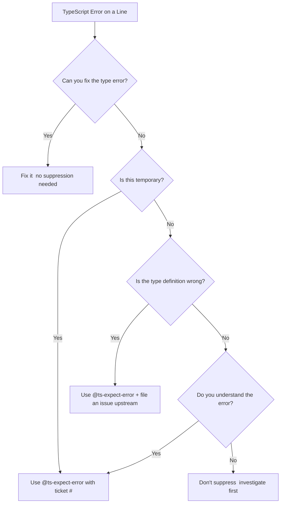

# How to Make TypeScript Ignore a Line

Sometimes TypeScript is wrong. Or more accurately  sometimes TypeScript is technically right, but you know something it doesn't. Maybe you're dealing with a third-party library with bad type definitions, or you're in the middle of a migration and you need to move fast without fixing every single type error right now.

That's where `// @ts-ignore` and `// @ts-expect-error` come in. They both tell TypeScript to suppress the error on the next line. But they work differently, and picking the wrong one can quietly introduce bugs. I've seen teams use `@ts-ignore` like a magic wand  sprinkle it everywhere, ship the code, and wonder six months later why their types are lying to them.

## @ts-ignore: The Blunt Instrument

`// @ts-ignore` tells TypeScript to completely ignore any error on the very next line. If there's an error, it's suppressed. If there's no error, nothing happens. TypeScript doesn't care either way.

```typescript
// @ts-ignore
const value: number = "this is clearly not a number";
```

No error. TypeScript just looks the other way. And that's the problem  `@ts-ignore` is silent whether or not there's actually an error to suppress. If you fix the underlying issue later, the comment just sits there doing nothing, and nobody knows it's stale.

## @ts-expect-error: The Smarter Alternative

`// @ts-expect-error` was added in TypeScript 3.9, and it works almost the same way  with one critical difference. It suppresses the error on the next line, but **if there's no error to suppress, it becomes an error itself**.

```typescript
// @ts-expect-error  forcing string into number for legacy compat
const value: number = "this is clearly not a number";
```

This compiles fine. But if someone later fixes the type mismatch:

```typescript
// @ts-expect-error  this now causes an error because there's nothing to suppress
const value: number = 42;
// ^ Unused '@ts-expect-error' directive.
```

TypeScript flags the now-unnecessary directive. That's a big deal. It means `@ts-expect-error` is self-cleaning  when the underlying problem goes away, the suppression comment doesn't silently hang around forever.

## When to Use Which

Here's my take, and I think most TypeScript teams would agree:

| Scenario | Use | Why |
|----------|-----|-----|
| Temporary workaround during migration | `@ts-expect-error` | Self-cleans when the migration is done |
| Testing that something *should* error | `@ts-expect-error` | Confirms the error exists  breaks if it disappears |
| Third-party lib with bad types | `@ts-expect-error` | You'll know when they fix their types |
| Quick prototype / throwaway code | `@ts-ignore` | If you genuinely don't care about type safety here |
| You can't explain *what* error you're suppressing | Neither | Fix the actual type error instead |

The honest answer? **Almost always use `@ts-expect-error`**. The only time `@ts-ignore` makes sense is when you're writing truly disposable code and you want zero friction. For anything that'll live in your codebase for more than a week, `@ts-expect-error` is strictly better.

> **Tip:** If you're migrating a JavaScript codebase and finding yourself reaching for `@ts-ignore` on every other line, the underlying problem is probably the migration approach itself. The [TypeScript migration strategy guide](/blog/typescript-migration-strategy) covers how to do incremental migration without drowning in suppressions.

## Always Add a Reason

Both directives accept a description after them. Use it.

```typescript
// @ts-expect-error  stripe SDK types don't include the beta field yet
const betaFeature = stripe.customers.betaEndpoint();
```

Without that explanation, the next person (or you in three months) has no idea why the suppression exists. Was it a bug workaround? A temporary hack? An intentional escape hatch? The comment should answer that question.

Some teams I've worked with even require the reason to include a ticket number:

```typescript
// @ts-expect-error  JIRA-1234: waiting on @types/lodash update
```

That way, when someone is cleaning up tech debt, they can check if the ticket is resolved and remove the suppression.

## ESLint Rules to Keep You Honest

If you're using `@typescript-eslint` (and you should be), there are two rules that pair perfectly with this:

**Ban `@ts-ignore` entirely:**

```json
{
  "rules": {
    "@typescript-eslint/ban-ts-comment": [
      "error",
      {
        "ts-ignore": true,
        "ts-expect-error": "allow-with-description",
        "minimumDescriptionLength": 10
      }
    ]
  }
}
```

This config does three things: blocks `@ts-ignore` completely, allows `@ts-expect-error` only if you include a description, and requires that description to be at least 10 characters (so you can't just write "fix later").

I've rolled this out on two different teams and both times the initial pushback lasted about a week before everyone agreed it was the right call.

## The Suppression Decision Flow



## Other Ways to Handle Type Issues

Before reaching for a suppression comment, consider whether one of these approaches solves your problem without silencing the type checker:

**Type assertions**  when you know more than TypeScript:

```typescript
const element = document.getElementById("app") as HTMLDivElement;
```

**The `any` escape hatch**  scoped to a single variable:

```typescript
const untypedLib = require("some-untyped-lib") as any;
```

**Declaration merging**  when a library's types are incomplete:

```typescript
declare module "some-library" {
  interface Config {
    betaFeature: boolean;
  }
}
```

These approaches are more targeted than line-level suppression. A type assertion says "I know this is a `HTMLDivElement`." A `@ts-expect-error` says "I don't know what's wrong and I don't care right now." There's a meaningful difference in intent.

## Why You Should Avoid Both When Possible

Here's the thing  every `@ts-ignore` or `@ts-expect-error` in your codebase is a small hole in your type safety net. One or two? Totally fine. Every codebase has edge cases. But if you're counting dozens of them, that's a code smell.

A team I worked with last year had over 200 `@ts-ignore` comments in their codebase. When we started auditing them, about 60% were suppressing errors that had already been fixed  the suppression was just hiding the fact that the types were actually correct now. Another 25% were masking real bugs. Only about 15% were legitimate.

If you're converting a JavaScript project to TypeScript and finding type errors everywhere, [SnipShift's JS to TypeScript converter](https://snipshift.dev/js-to-ts) can help generate proper types from your existing code  so you're starting with real interfaces instead of a pile of suppressions.

For the full picture on how TypeScript's type system works and why it matters, the [complete JS to TypeScript conversion guide](/blog/convert-javascript-to-typescript) walks through the entire process. And if you're still weighing whether TypeScript is worth the investment, [here's why TypeScript in 2026](/blog/why-use-typescript-2026) is essentially a settled question.

Use `@ts-expect-error` over `@ts-ignore`. Always include a reason. Set up ESLint to enforce it. And treat every suppression as temporary debt, not a permanent fixture. Your future self  and whoever inherits your code  will thank you.
