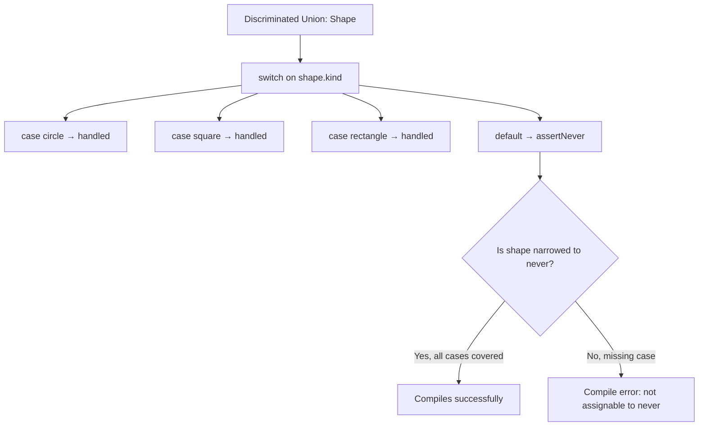

# What Is 'never' Type in TypeScript and When Do You Use It?

Most TypeScript types describe what a value *can* be. `string`, `number`, `boolean`  these are sets of possible values. The **typescript never type** is different. It represents the *empty set*. A value that can never exist. A function that can never return. A branch of code that should never be reached.

That sounds abstract, but `never` is one of the most practical types in the language once you know where to use it. It's the backbone of exhaustive type checking, and it catches a specific class of bugs that nothing else can.

## Where `never` Shows Up Naturally

You've probably been using `never` without realizing it. TypeScript infers it in several places:

### Functions That Never Return

If a function always throws or runs forever, its return type is `never`:

```typescript
function throwError(message: string): never {
  throw new Error(message);
}

function infiniteLoop(): never {
  while (true) {
    // Process events forever
  }
}
```

This isn't just an academic distinction. When TypeScript knows a function returns `never`, it understands that code *after* a call to that function is unreachable. This helps with type narrowing:

```typescript
function getUser(id: string): User {
  const user = db.find(id);
  if (!user) {
    throwError(`User ${id} not found`); // returns never
  }
  // TypeScript knows: if we got here, user is definitely not null
  return user; // type: User, not User | null
}
```

Without the `never` return type on `throwError`, TypeScript wouldn't narrow `user` after the `if` block. It would still think `user` might be `null`.

### The Bottom of Type Narrowing

When you narrow a union type down to nothing, the result is `never`:

```typescript
function process(value: string | number) {
  if (typeof value === "string") {
    // value is string here
  } else if (typeof value === "number") {
    // value is number here
  } else {
    // value is never here  all possibilities exhausted
    console.log(value); // type: never
  }
}
```

That `else` branch is unreachable. TypeScript proves it by narrowing `value` to `never`. And this is where the real power comes in.

## Exhaustive Checks: The Killer Feature of `never`

This is the pattern that made me actually *care* about the `never` type. Say you have a discriminated union:

```typescript
type Shape =
  | { kind: "circle"; radius: number }
  | { kind: "square"; side: number }
  | { kind: "rectangle"; width: number; height: number };
```

And a function that handles each variant:

```typescript
function area(shape: Shape): number {
  switch (shape.kind) {
    case "circle":
      return Math.PI * shape.radius ** 2;
    case "square":
      return shape.side ** 2;
    case "rectangle":
      return shape.width * shape.height;
  }
}
```

This works. But what happens three months from now when someone adds `{ kind: "triangle"; base: number; height: number }` to the `Shape` union? The `area` function compiles fine  TypeScript doesn't force you to handle the new variant. It just silently returns `undefined`, and now you've got a bug.

Here's the fix  the **exhaustive check pattern**:

```typescript
function assertNever(value: never): never {
  throw new Error(`Unexpected value: ${JSON.stringify(value)}`);
}

function area(shape: Shape): number {
  switch (shape.kind) {
    case "circle":
      return Math.PI * shape.radius ** 2;
    case "square":
      return shape.side ** 2;
    case "rectangle":
      return shape.width * shape.height;
    default:
      return assertNever(shape);
      // If all cases handled: shape is 'never', compiles fine
      // If a case is missing: shape is NOT 'never', compile error!
  }
}
```

Now add `"triangle"` to the union:

```typescript
type Shape =
  | { kind: "circle"; radius: number }
  | { kind: "square"; side: number }
  | { kind: "rectangle"; width: number; height: number }
  | { kind: "triangle"; base: number; height: number }; // New!
```

Immediately, the `area` function throws a compile error:

```
Argument of type '{ kind: "triangle"; base: number; height: number; }'
is not assignable to parameter of type 'never'.
```

TypeScript is telling you: "Hey, you didn't handle triangle, so `shape` isn't `never` in the default branch." You literally cannot forget to handle a new union member. The compiler forces you to update every switch statement that touches this union.



I've used this pattern on every production TypeScript project I've worked on in the last three years. It's caught bugs during refactors more times than I can count. A team I worked with called it "the `never` safety net"  whenever they added a new variant to a union, the compiler would light up every location that needed updating. No manual searching. No missed spots.

> **Tip:** Some teams use the `satisfies never` pattern instead of a helper function: `default: const _exhaustive: never = shape;`. Both work. I prefer the `assertNever` function because it also gives you a meaningful runtime error if somehow an unexpected value makes it through.

## `never` in Conditional Types

If you're writing utility types, `never` acts as the "discard" value in conditional types:

```typescript
// Extract only string properties from a type
type StringKeys<T> = {
  [K in keyof T]: T[K] extends string ? K : never;
}[keyof T];

interface User {
  id: number;
  name: string;
  email: string;
  age: number;
}

type UserStringKeys = StringKeys<User>;
// Result: "name" | "email"
```

The `never` values get automatically filtered out of union types. So `"name" | "email" | never | never` simplifies to `"name" | "email"`. It's like `never` is the zero of the type system  adding it to a union changes nothing.

This is how many of TypeScript's built-in utility types work under the hood. `Exclude<T, U>` is literally `T extends U ? never : T`  it keeps the parts of the union that don't match and discards the rest using `never`.

```typescript
type Exclude<T, U> = T extends U ? never : T;

type Result = Exclude<"a" | "b" | "c", "a">;
// "a" extends "a" ? never : "a" = never
// "b" extends "a" ? never : "b" = "b"
// "c" extends "a" ? never : "c" = "c"
// Union: never | "b" | "c" = "b" | "c"
```

## `never` vs `void` vs `undefined`

These three get confused a lot, so let's clear it up:

| Type | Meaning | Function returns... |
|------|---------|-------------------|
| `void` | Function doesn't return a useful value | Implicitly returns `undefined` |
| `undefined` | The value `undefined` | Explicitly returns `undefined` |
| `never` | Function never completes | Throws or loops forever |

```typescript
function logMessage(msg: string): void {
  console.log(msg);
  // Implicitly returns undefined  that's fine for void
}

function getUndefined(): undefined {
  return undefined;
  // Must explicitly return undefined
}

function fail(msg: string): never {
  throw new Error(msg);
  // Never reaches a return statement
}
```

The practical difference: you can call a `void` function and ignore the result. You can't do anything after calling a `never` function  TypeScript knows execution stops there.

## Practical Patterns to Start Using Today

### Pattern 1: Exhaustive Switches (shown above)
Use `assertNever` in the default branch of any switch on a discriminated union. This is the single most valuable use of `never`.

### Pattern 2: Impossible Function Parameters

```typescript
// A function that should only be called with specific overloads
function processEvent(event: "click", x: number, y: number): void;
function processEvent(event: "keypress", key: string): void;
function processEvent(event: never): never; // Catch-all  no other events allowed
function processEvent(event: string, ...args: unknown[]) {
  // Implementation
}
```

### Pattern 3: Branded Types That Can't Be Constructed Accidentally

```typescript
type UserId = string & { readonly __brand: never };

function createUserId(id: string): UserId {
  // Validate and return
  return id as UserId;
}

// Can't accidentally use a plain string as UserId
function getUser(id: UserId) { /* ... */ }
getUser("abc");            // Error
getUser(createUserId("abc")); // Works
```

The `never` brand ensures that no real value can accidentally match the branded type  you have to go through the constructor function.

If you're building typed applications with discriminated unions and want to generate proper TypeScript types from your data, [SnipShift's JS to TypeScript converter](https://snipshift.dev/js-to-ts) can help get you started  especially when migrating from untyped JavaScript where these patterns didn't exist before.

For more on the type patterns that pair well with `never`, check out our [TypeScript generics guide](/blog/typescript-generics-explained)  conditional types and `never` go hand in hand. And if you're trying to decide between `interface` and `type` for your discriminated unions, our [interface vs type comparison](/blog/typescript-interface-vs-type) has you covered. For the full picture on moving your codebase to TypeScript, our [migration strategy guide](/blog/typescript-migration-strategy) covers the process from start to finish.
