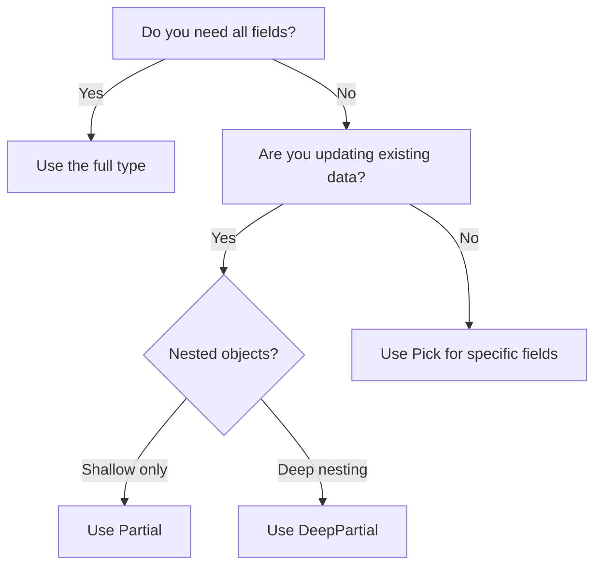

# How to Make All Properties Optional in TypeScript (Partial, DeepPartial)

You've got a `User` interface with ten required properties. Now you need to write an update function that accepts any subset of those properties  maybe you're only updating the user's name, or just their email. You don't want to pass the entire object every time.

This is one of the most common TypeScript questions I see, and the answer is simpler than most people expect. But there's a catch that trips up almost everyone once they start working with nested objects.

## What `Partial<T>` Does

TypeScript ships with a built-in utility type called `Partial<T>`. It takes a type and makes every property optional. That's it.

```typescript
interface User {
  id: number;
  name: string;
  email: string;
  role: "admin" | "user";
  createdAt: Date;
}

// All properties become optional
type PartialUser = Partial<User>;
// equivalent to:
// {
//   id?: number;
//   name?: string;
//   email?: string;
//   role?: "admin" | "user";
//   createdAt?: Date;
// }
```

The most common use case is update functions. Instead of requiring every field, you accept a `Partial` of the type:

```typescript
async function updateUser(userId: number, updates: Partial<User>) {
  // Only the fields the caller passes get updated
  await db.users.update({ where: { id: userId }, data: updates });
}

// Now you can update just the name
await updateUser(1, { name: "New Name" });

// Or just the role
await updateUser(1, { role: "admin" });

// TypeScript catches typos and invalid values
await updateUser(1, { nmae: "Oops" }); // ❌ Error: 'nmae' does not exist
await updateUser(1, { role: "superadmin" }); // ❌ Error: not assignable
```

Under the hood, `Partial` is defined as a mapped type  it's actually pretty elegant:

```typescript
// This is the actual definition in TypeScript's lib
type Partial<T> = {
  [P in keyof T]?: T[P];
};
```

It iterates over every key in `T` and adds a `?` to make it optional. Simple, powerful, and built right into the language.

> **Tip:** `Partial` pairs well with the spread operator for applying defaults. `const config = { ...defaultConfig, ...userConfig }` where `userConfig` is `Partial<Config>` gives you type-safe overrides without requiring every field.

## The Problem: `Partial` Is Only One Level Deep

Here's where people get burned. `Partial<T>` only makes the *top-level* properties optional. If you have nested objects, the inner properties stay required.

```typescript
interface UserProfile {
  name: string;
  email: string;
  address: {
    street: string;
    city: string;
    zip: string;
  };
  preferences: {
    theme: "light" | "dark";
    notifications: boolean;
  };
}

type PartialProfile = Partial<UserProfile>;
// address?: { street: string; city: string; zip: string }
//                    ^^^^^^ still required!

// This is fine:
const update1: PartialProfile = { name: "Alice" };

// But this fails  you can't partially update the address:
const update2: PartialProfile = {
  address: { city: "Portland" }, // ❌ Error: missing 'street' and 'zip'
};
```

If you want to make all properties optional in TypeScript  including nested ones  you need `DeepPartial`.

## Building a `DeepPartial` Type

TypeScript doesn't include `DeepPartial` out of the box, but building one is only a few lines with a recursive mapped type:

```typescript
type DeepPartial<T> = {
  [P in keyof T]?: T[P] extends object
    ? DeepPartial<T[P]>
    : T[P];
};
```

This recursively applies `Partial` to every level of the object. Now nested updates work:

```typescript
type DeepPartialProfile = DeepPartial<UserProfile>;

// Partial nested update  works perfectly
const update: DeepPartialProfile = {
  address: { city: "Portland" }, // ✅ No error
  preferences: { theme: "dark" }, // ✅ No error
};
```

There's one subtlety worth mentioning. The basic `DeepPartial` above will also recurse into arrays and other object types, which might not be what you want. A more robust version handles this:

```typescript
type DeepPartial<T> = T extends Function
  ? T
  : T extends Array<infer U>
    ? Array<DeepPartial<U>>
    : T extends object
      ? { [P in keyof T]?: DeepPartial<T[P]> }
      : T;
```

This version leaves functions alone, properly handles arrays, and only recurses into plain objects. If this kind of recursive type gymnastics makes your head spin, that's normal. I've been writing TypeScript for years and I still have to think carefully through conditional types.

If you want to understand the generics patterns behind this, our [TypeScript generics guide](/blog/typescript-generics-explained) breaks down `<T>`, constraints, and conditional types with real-world examples.

> **Warning:** Don't roll your own `DeepPartial` if you're already using a utility library. Both [type-fest](https://github.com/sindresorhus/type-fest) and [ts-toolbelt](https://github.com/millsp/ts-toolbelt) ship battle-tested versions that handle edge cases you probably haven't thought of.

## Quick Comparison: TypeScript Utility Types for Optional Properties

| Utility Type | What It Does | Built-in? |
|-------------|-------------|-----------|
| `Partial<T>` | Makes all top-level properties optional | Yes |
| `Required<T>` | Makes all top-level properties required (opposite of Partial) | Yes |
| `Pick<T, K>` | Selects specific properties from a type | Yes |
| `Omit<T, K>` | Removes specific properties from a type | Yes |
| `DeepPartial<T>` | Makes ALL properties optional, recursively | No  DIY or use type-fest |

These compose nicely together. Need a type with only `name` and `email`, both optional? `Partial<Pick<User, "name" | "email">>`. Need everything except `id`, all required? `Required<Omit<User, "id">>`. The combination possibilities are sort of endless  but try not to go overboard. If your type expression is longer than the interface it's based on, just write a new interface.

## When NOT to Use `Partial`

I've seen teams default to `Partial` everywhere, and it creates a different kind of problem  you lose the guarantee that required fields are actually present.

A few places where `Partial` is the wrong choice:

- **API response types.** If your API always returns a full user object, type it as `User`, not `Partial<User>`. Otherwise you'll be null-checking every field for no reason.
- **Form validation output.** After validation succeeds, all required fields should be present. Use the full type, not partial.
- **Database insert operations.** Most ORMs need all required fields for an insert. Use `Partial` for updates, but the full type (or `Omit<User, "id">`) for inserts.

The right mental model: `Partial` is for *patches*  situations where you're modifying a subset of an existing record. If you're creating something new, you usually want all the required fields to be required.



If you're converting JavaScript code to TypeScript and want proper interfaces generated automatically  including the right use of optional vs required properties  [SnipShift's JS to TypeScript converter](https://snipshift.dev/js-to-ts) infers types from your actual code rather than just slapping `any` on everything.

For more on choosing between `interface` and `type` when defining these structures, check out our [interface vs type comparison](/blog/typescript-interface-vs-type). And if you want to avoid the most common TypeScript gotchas (including misusing utility types), our [common TypeScript mistakes guide](/blog/common-typescript-mistakes) is worth a read.

`Partial` is one of those utility types that seems basic but shows up everywhere once you know it exists. Use it for update DTOs, form state, test fixtures, config overrides  anywhere you need flexibility without giving up type safety. And when shallow isn't deep enough, `DeepPartial` has your back.

Explore more free developer tools at [SnipShift.dev](https://snipshift.dev).
