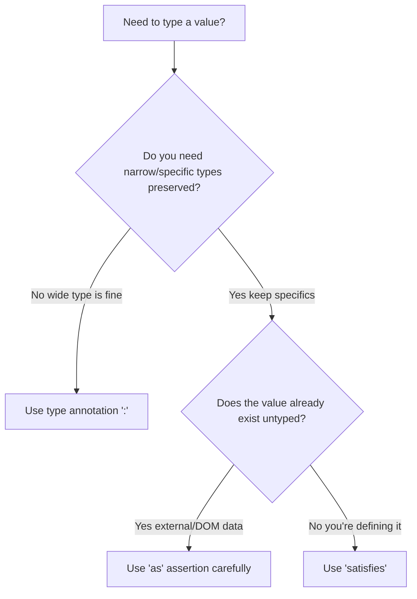

# What Is the 'satisfies' Operator in TypeScript? (And Why It's a Big Deal)

TypeScript 4.9 shipped a feature that doesn't get nearly enough attention for how useful it is. The `satisfies` operator solves a problem that's been annoying TypeScript developers for years  and if you haven't started using it yet, you're probably writing more verbose code than you need to.

Here's the problem in one sentence: before `satisfies`, you had to choose between type safety and type inference. You could annotate a variable with a type (safe but loses specificity), or you could let TypeScript infer it (specific but no validation). You couldn't have both.

Now you can. And that changes how you write a lot of everyday TypeScript.

## The Problem `satisfies` Solves

Let me show you the dilemma with a real example. Say you're building a color palette:

```typescript
type Color = "red" | "green" | "blue";

type ColorConfig = Record<Color, string | number[]>;
```

Now you want to define your palette. You have two options, and both have downsides.

**Option 1: Type annotation**

```typescript
const palette: ColorConfig = {
  red: "#ff0000",
  green: [0, 255, 0],
  blue: "#0000ff",
};

// Problem: TypeScript forgot the specific types
palette.red.toUpperCase(); // Error! Property 'toUpperCase' does not exist on type 'string | number[]'
```

TypeScript validates that `palette` matches `ColorConfig`  great. But it also *widens* every value to `string | number[]`. So even though `red` is clearly a string, TypeScript won't let you call `.toUpperCase()` on it without narrowing first. You've lost the specificity of your data.

**Option 2: No annotation (inference)**

```typescript
const palette = {
  red: "#ff0000",
  green: [0, 255, 0],
  blue: "#0000ff",
};

palette.red.toUpperCase(); // Works! TypeScript knows it's a string
```

Now TypeScript infers the exact types  `red` is `string`, `green` is `number[]`. But there's no validation against `ColorConfig`. You could misspell a color name or add an invalid one, and TypeScript wouldn't say a word:

```typescript
const palette = {
  red: "#ff0000",
  grean: [0, 255, 0], // Typo  no error!
  blue: "#0000ff",
  purple: "#800080",  // Not in Color  no error!
};
```

Neither option gives you what you actually want: validation *and* inference.

## Enter `satisfies`

```typescript
const palette = {
  red: "#ff0000",
  green: [0, 255, 0],
  blue: "#0000ff",
} satisfies ColorConfig;

// Validation: catches typos and invalid keys ✓
// Inference: preserves specific types ✓
palette.red.toUpperCase();  // Works  TypeScript knows it's a string
palette.green.map(x => x);  // Works  TypeScript knows it's number[]
```

The `satisfies` operator validates that the expression matches the given type, but it doesn't *widen* the type. TypeScript still infers the most specific type possible. You get the best of both worlds.

And if you make a mistake:

```typescript
const palette = {
  red: "#ff0000",
  grean: [0, 255, 0], // Error! 'grean' is not in type 'ColorConfig'
  blue: "#0000ff",
} satisfies ColorConfig;
```

Caught. Exactly what you'd want.

## `satisfies` vs. `as`  They're Not the Same

I want to be clear about this because I've seen people conflate them. The `as` keyword is a *type assertion*  it tells TypeScript "treat this value as this type, even if you're not sure." It's an override. It can lie.

```typescript
const palette = {
  red: "#ff0000",
  green: [0, 255, 0],
  blue: "#0000ff",
} as ColorConfig;

// TypeScript trusts you  even if you're wrong
const broken = {
  red: 42, // 42 is not string | number[]  but 'as' doesn't check!
} as ColorConfig;
```

`as` doesn't validate anything. It's a cast. You're telling TypeScript to believe you. `satisfies` actually checks.

| Feature | Type Annotation (`:`) | `as` Assertion | `satisfies` |
|---------|:---:|:---:|:---:|
| Validates shape | Yes | No | Yes |
| Preserves inference | No | No | **Yes** |
| Catches extra props | Yes | No | Yes |
| Catches missing props | Yes | No | Yes |
| Can lie to compiler | No | **Yes** | No |

Hot take: in most places where people use `as`, they should probably be using `satisfies` instead. The `as` keyword has legitimate uses  like when you're working with DOM elements or handling data from untyped sources  but for regular type validation, `satisfies` is strictly better.

## The Configuration Object Use Case

This is where `satisfies` really shines in day-to-day code. Configuration objects are everywhere, and they're the perfect candidate.

```typescript
interface RouteConfig {
  path: string;
  method: "GET" | "POST" | "PUT" | "DELETE";
  auth: boolean;
}

const routes = {
  getUsers: {
    path: "/api/users",
    method: "GET",
    auth: true,
  },
  createUser: {
    path: "/api/users",
    method: "POST",
    auth: true,
  },
  health: {
    path: "/health",
    method: "GET",
    auth: false,
  },
} satisfies Record<string, RouteConfig>;
```

Without `satisfies`, you'd need a type annotation  and then `routes.getUsers.method` would be typed as `"GET" | "POST" | "PUT" | "DELETE"` instead of just `"GET"`. With `satisfies`, TypeScript knows that `routes.getUsers.method` is literally `"GET"`. That specificity matters when you're doing conditional logic or passing values to functions that expect narrow types.

Here's another one I use all the time  translation/i18n objects:

```typescript
type Locale = "en" | "es" | "fr";

const translations = {
  en: {
    greeting: "Hello",
    farewell: "Goodbye",
  },
  es: {
    greeting: "Hola",
    farewell: "Adiós",
  },
  fr: {
    greeting: "Bonjour",
    farewell: "Au revoir",
  },
} satisfies Record<Locale, Record<string, string>>;
```

Every locale is validated. Every value is validated. But TypeScript still knows the exact keys available  `translations.en.greeting` autocompletes perfectly.

## When to Use `satisfies` vs. Type Annotation

Here's my mental model:

- **Use a type annotation (`:`)** when you want to *enforce* a type and don't care about preserving narrower inference. This is common for function parameters, class properties, and variables that get reassigned.

- **Use `satisfies`** when you want to *validate* a type but keep the inferred type as specific as possible. This is perfect for configuration objects, constant definitions, and record-like data structures.

- **Use `as`** only when you're working with values whose types TypeScript genuinely can't figure out  like DOM queries, data from external APIs, or test mocks.



## Combining `satisfies` with `as const`

One more trick that's worth knowing. You can combine `satisfies` with `as const` for maximum specificity:

```typescript
const palette = {
  red: "#ff0000",
  green: "#00ff00",
  blue: "#0000ff",
} as const satisfies Record<Color, string>;
```

The `as const` makes every value a literal type (`"#ff0000"` instead of `string`), and `satisfies` validates the shape. This is powerful for configuration that you want to be both validated and deeply readonly.

> **Tip:** If you're converting a JavaScript codebase to TypeScript, you won't need `satisfies` during the initial conversion  but it's the kind of thing that makes your TypeScript *better* once the basics are in place. Start with [getting your JS converted](/blog/convert-javascript-to-typescript), then refine with `satisfies` where it makes sense. [SnipShift's converter](https://snipshift.dev/js-to-ts) can handle the initial conversion, and you can layer in `satisfies` afterward.

## Real-World Pattern: Type-Safe Event Maps

Here's a pattern from a project I worked on recently that shows off `satisfies` nicely:

```typescript
interface EventDef {
  payload: Record<string, unknown>;
  description: string;
}

const analyticsEvents = {
  pageView: {
    payload: { url: "", referrer: "" },
    description: "User visited a page",
  },
  buttonClick: {
    payload: { buttonId: "", label: "" },
    description: "User clicked a button",
  },
  formSubmit: {
    payload: { formId: "", fields: 0 },
    description: "User submitted a form",
  },
} satisfies Record<string, EventDef>;

// TypeScript knows the exact keys
type EventName = keyof typeof analyticsEvents; // "pageView" | "buttonClick" | "formSubmit"
```

Without `satisfies`, you'd either lose the specific key names (with a type annotation) or lose validation (without one). With `satisfies`, you get a validated event map *and* a precise union type derived from it. That's genuinely useful.

The `satisfies` operator isn't flashy. It doesn't unlock some wild new capability. But it removes a friction point that's been bugging TypeScript developers for years  and once you start using it, you'll wonder how you ever typed config objects without it.

For more on getting your types right, check out our guides on [TypeScript generics](/blog/typescript-generics-explained) and the [keyof operator](/blog/typescript-keyof-explained). They pair well with `satisfies` for building type-safe, flexible APIs.
