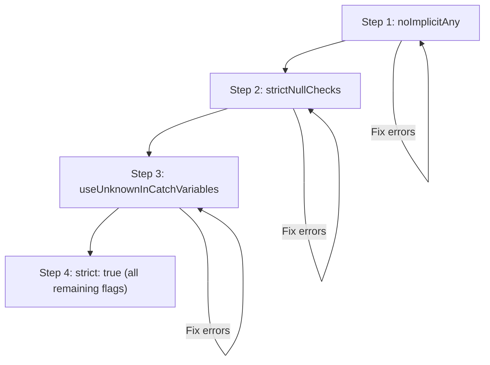

# TypeScript Strict Mode: What It Does and Why You Should Enable It

When I first started with TypeScript, I left `strict: false` for about six months. I thought I was being productive  fewer errors, faster development, less fighting with the compiler. Then I turned on strict mode and found eleven bugs in our codebase. Eleven. Including one that had been causing intermittent 500 errors in production for weeks.

TypeScript strict mode isn't a single setting  it's a collection of compiler flags that, together, give you the full power of TypeScript's type system. Running without it is like wearing a seatbelt but not buckling it. You look safe, but you're not.

Here's what each flag does, what it catches, and how to enable typescript strict mode incrementally without overwhelming your team.

## What `strict: true` Actually Enables

When you set `"strict": true` in your `tsconfig.json`, it's shorthand for enabling all of these flags at once:

```json
{
  "compilerOptions": {
    "strict": true
    // Equivalent to ALL of the following:
    // "noImplicitAny": true,
    // "strictNullChecks": true,
    // "strictFunctionTypes": true,
    // "strictBindCallApply": true,
    // "strictPropertyInitialization": true,
    // "noImplicitThis": true,
    // "useUnknownInCatchVariables": true,
    // "alwaysStrict": true
  }
}
```

You can also enable them individually, which is exactly what I recommend during migration. Let me walk through each one.

## The Flags, Ranked by Impact

### 1. `noImplicitAny`  The Big One

**What it does:** Prevents variables, parameters, and return values from silently defaulting to `any`.

**What it catches:** Untyped function parameters, untyped destructured variables, functions with no return type annotation where inference fails.

```typescript
// Without noImplicitAny  this compiles, everything is 'any'
function processData(data) {
  return data.map(item => item.value);
}

// With noImplicitAny  error on 'data' and 'item'
function processData(data) {
  //                  ^^^^ Parameter 'data' implicitly has an 'any' type
}

// Fixed
function processData(data: DataItem[]): number[] {
  return data.map(item => item.value);
}
```

**Expected error count:** High. This is usually the flag that generates the most errors  every untyped function parameter in your codebase becomes an error.

**My advice:** Enable this first. It's the flag that provides the most value per effort. Without it, you might as well be writing JavaScript.

### 2. `strictNullChecks`  The Bug Finder

**What it does:** Makes `null` and `undefined` their own types instead of being assignable to everything.

**What it catches:** Null pointer errors, missing optional chaining, forgetting to handle the "not found" case.

```typescript
// Without strictNullChecks
function getUser(id: string): User {
  return users.find(u => u.id === id); // Returns User | undefined, but TS says User
  // .find() can return undefined, but TS ignores this!
}

// With strictNullChecks  error!
function getUser(id: string): User {
  return users.find(u => u.id === id);
  // Error: Type 'User | undefined' is not assignable to type 'User'
}

// Fixed  handle the undefined case
function getUser(id: string): User | undefined {
  return users.find(u => u.id === id);
}

// Or throw if not found
function getUser(id: string): User {
  const user = users.find(u => u.id === id);
  if (!user) throw new Error(`User ${id} not found`);
  return user;
}
```

**Expected error count:** Medium. Depends on how much your code assumes things are never null (spoiler: most JavaScript code assumes this constantly).

**My advice:** Enable this second. This flag finds more *real* bugs than any other. That production null pointer crash you've been debugging? This catches it at compile time.

> **Tip:** When enabling `strictNullChecks`, you'll use optional chaining (`?.`) and nullish coalescing (`??`) a lot. If you're not familiar with these operators, now's the time to learn them  they make null handling concise.

### 3. `strictFunctionTypes`  The Subtle One

**What it does:** Enforces contravariant function parameter checking. In plain English: it prevents you from passing a function that accepts a *narrower* type where a function accepting a *wider* type is expected.

```typescript
// Without strictFunctionTypes  this compiles but is unsafe
type Handler = (event: Event) => void;

const handleMouse: Handler = (event: MouseEvent) => {
  console.log(event.clientX); // Unsafe! Not every Event has clientX
};

// With strictFunctionTypes  error
const handleMouse: Handler = (event: MouseEvent) => {
  // Error: Type '(event: MouseEvent) => void' is not assignable to type 'Handler'
};
```

**Expected error count:** Low. Most code doesn't hit this.

### 4. `strictBindCallApply`  The Safety Net

**What it does:** Type-checks `bind`, `call`, and `apply` properly instead of treating them as `any`.

```typescript
function greet(name: string, greeting: string): string {
  return `${greeting}, ${name}!`;
}

// Without strictBindCallApply
greet.call(null, 42, 'Hello'); // No error  but 42 is not a string!

// With strictBindCallApply
greet.call(null, 42, 'Hello');
// Error: Argument of type 'number' is not assignable to parameter of type 'string'
```

**Expected error count:** Low, unless your codebase uses `.bind()`, `.call()`, or `.apply()` a lot.

### 5. `strictPropertyInitialization`  The Class Guardian

**What it does:** Ensures class properties are initialized in the constructor or have a definite assignment.

```typescript
// Without strictPropertyInitialization  compiles
class UserService {
  private apiUrl: string;
  // Never initialized! Using this.apiUrl will be undefined
}

// With strictPropertyInitialization  error
class UserService {
  private apiUrl: string;
  // Error: Property 'apiUrl' has no initializer and is not definitely assigned

  // Fixed  initialize it
  private apiUrl: string = '/api/users';

  // Or assign in constructor
  constructor(apiUrl: string) {
    this.apiUrl = apiUrl;
  }
}
```

**Expected error count:** Medium if your codebase uses classes heavily. Low otherwise.

### 6. `noImplicitThis`  The Context Checker

**What it does:** Flags functions where `this` has an implicit `any` type.

```typescript
// Without noImplicitThis
function logName() {
  console.log(this.name); // What is 'this'? Nobody knows.
}

// With noImplicitThis  error
function logName() {
  console.log(this.name);
  // Error: 'this' implicitly has type 'any'
}

// Fixed  declare what 'this' is
function logName(this: { name: string }) {
  console.log(this.name);
}
```

**Expected error count:** Low in modern codebases that use arrow functions and avoid `this` trickery.

### 7. `useUnknownInCatchVariables`  The Error Handler

**What it does:** Makes `catch` clause variables `unknown` instead of `any`.

```typescript
// Without useUnknownInCatchVariables
try {
  doSomething();
} catch (error) {
  console.log(error.message); // 'error' is 'any'  no checking
}

// With useUnknownInCatchVariables
try {
  doSomething();
} catch (error) {
  console.log(error.message);
  // Error: 'error' is of type 'unknown'

  // Fixed  narrow the type first
  if (error instanceof Error) {
    console.log(error.message); // Now TypeScript knows it's an Error
  }
}
```

**Expected error count:** Depends on how many try/catch blocks you have. Usually moderate.

### 8. `alwaysStrict`  The Module Enforcer

**What it does:** Emits `"use strict"` at the top of every file and parses in strict mode.

**Expected error count:** Usually zero if you're already using ES Modules (which are strict by default).

## The Incremental Enable Strategy

Here's the order I recommend. Each step builds on the last:



| Step | Flag | Typical Fix Time | What You'll Learn |
|------|------|-----------------|-------------------|
| 1 | `noImplicitAny` | 1-5 days | How to annotate functions and variables |
| 2 | `strictNullChecks` | 1-3 days | Optional chaining, null guards, undefined handling |
| 3 | `useUnknownInCatchVariables` | A few hours | Proper error handling patterns |
| 4 | `strict: true` | A few hours | Class initialization, function type variance |

**Don't skip straight to `strict: true`.** I know it's tempting. But if you're migrating an existing codebase, going straight to full strict will dump hundreds or thousands of errors on you at once. That's demoralizing, and demoralized teams abandon migrations.

Instead, turn on one flag, fix those errors (even if it takes a few days), commit, and then turn on the next one. Each step is manageable, and you learn the patterns as you go.

## Bonus: `noUncheckedIndexedAccess`

This flag isn't part of `strict: true`, but I always enable it:

```typescript
// Without noUncheckedIndexedAccess
const arr = [1, 2, 3];
const item = arr[5]; // type: number (but it's actually undefined!)

// With noUncheckedIndexedAccess
const item = arr[5]; // type: number | undefined
// Forces you to check before using
if (item !== undefined) {
  console.log(item * 2); // Safe
}
```

This catches array and object index access bugs that even `strictNullChecks` misses. Add it to your tsconfig alongside strict:

```json
{
  "compilerOptions": {
    "strict": true,
    "noUncheckedIndexedAccess": true
  }
}
```

## Is It Worth the Effort?

Yes. Absolutely. Without qualification.

Every team I've worked with that enabled strict mode found real bugs. Not one exception. The flags exist because they catch real categories of errors that would otherwise reach production.

The effort to enable strict mode on an existing codebase is a one-time cost. The bugs it prevents are an ongoing benefit. Do the math  it's not even close.

If you're starting a TypeScript migration and want to see what fully typed code looks like, [SnipShift's converter](https://snipshift.dev/js-to-ts) generates strict-mode-compatible TypeScript from JavaScript. It's a good way to understand the patterns before you start fixing errors.

For the complete migration process including when to enable each strict flag, our [5-step TypeScript migration strategy](/blog/typescript-migration-strategy) walks through the full timeline. And for a reference of all the common mistakes developers make when first adopting TypeScript's stricter settings, check out our guide on [common TypeScript mistakes](/blog/common-typescript-mistakes).
