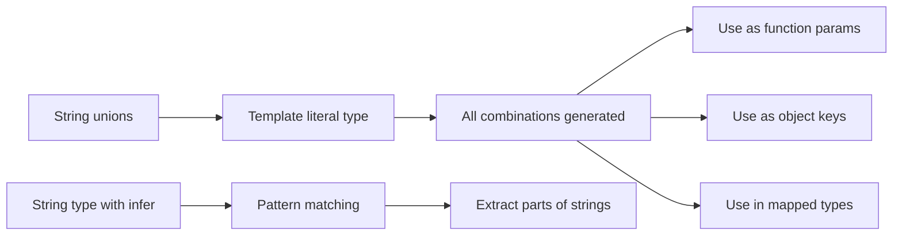

# Template Literal Types in TypeScript: Build Types from Strings

TypeScript has this feature that feels like it shouldn't work. You can take string literal types and *combine* them  with template syntax  to create new string literal types. It's like template literals in JavaScript, but at the type level.

When I first saw this feature, I thought it was a party trick. Then I used it to type an API routing layer, and I was completely sold. Template literal types let you express patterns in strings that would otherwise require massive hand-written union types or just giving up and using `string`.

## The Basic Syntax

If you know JavaScript template literals, the type syntax is identical:

```typescript
type Greeting = `Hello, ${string}`;

const a: Greeting = "Hello, world";    // Works
const b: Greeting = "Hello, Alice";    // Works
const c: Greeting = "Hi, world";       // Error! Doesn't match the pattern
```

The type `\`Hello, ${string}\`` means "any string that starts with `Hello, `." That's already useful for catching typos and enforcing naming conventions.

But the real power comes when you combine it with *union types*.

## Combining with Unions: Generating All Combinations

When you put a union type inside a template literal type, TypeScript generates every possible combination:

```typescript
type Color = "red" | "green" | "blue";
type Shade = "light" | "dark";

type ColorVariant = `${Shade}-${Color}`;
// "light-red" | "light-green" | "light-blue" | "dark-red" | "dark-green" | "dark-blue"
```

Six types, generated from two small unions. TypeScript does the cartesian product automatically. And this scales  if you add a new color or shade, all combinations update.

Here's a more practical example. Say you're building an event system:

```typescript
type Entity = "user" | "post" | "comment";
type Action = "created" | "updated" | "deleted";

type EventName = `${Entity}:${Action}`;
// "user:created" | "user:updated" | "user:deleted" |
// "post:created" | "post:updated" | "post:deleted" |
// "comment:created" | "comment:updated" | "comment:deleted"
```

Nine event names, all type-safe, generated from two three-member unions. If you add `"like"` to `Entity`, you get three new events automatically. No manual updates needed.

```typescript
function subscribe(event: EventName, handler: () => void) {
  // ...
}

subscribe("user:created", () => {});  // Works
subscribe("user:removed", () => {});  // Error! "user:removed" is not a valid event
```

I've used this exact pattern in production. Before template literal types, we maintained a hand-written union of 30+ event names. Every time we added an entity, someone would forget to add the event names. Now it's two unions and a template, and it just works.

## Intrinsic String Manipulation Types

TypeScript ships four built-in types for manipulating string literals:

```typescript
type A = Uppercase<"hello">;    // "HELLO"
type B = Lowercase<"HELLO">;    // "hello"
type C = Capitalize<"hello">;   // "Hello"
type D = Uncapitalize<"Hello">; // "hello"
```

These work on literal types, not runtime strings. And they combine beautifully with template literals:

```typescript
type Entity = "user" | "post" | "comment";

type GetterName = `get${Capitalize<Entity>}`;
// "getUser" | "getPost" | "getComment"

type SetterName = `set${Capitalize<Entity>}`;
// "setUser" | "setPost" | "setComment"

type HandlerName = `on${Capitalize<Entity>}Change`;
// "onUserChange" | "onPostChange" | "onCommentChange"
```

This is incredibly useful for typing APIs that follow naming conventions. If your getter functions are always `get` + capitalized entity name, you can express that directly in the type system.

Here's a real-world pattern  generating CSS custom property names:

```typescript
type SpacingScale = "xs" | "sm" | "md" | "lg" | "xl";
type SpacingProperty = "margin" | "padding";
type Direction = "top" | "right" | "bottom" | "left";

type CSSCustomProp = `--${SpacingProperty}-${Direction}-${SpacingScale}`;
// "--margin-top-xs" | "--margin-top-sm" | ... (40 total combinations)
```

Forty type-safe CSS custom property names, generated from three small unions. Add a new spacing scale and all 8 new properties appear automatically.

## Real Example: Typing API Routes

This is the example that made me a believer. Say you have a REST API with predictable route patterns:

```typescript
type Resource = "users" | "posts" | "comments";
type ApiVersion = "v1" | "v2";

type ListRoute = `/${ApiVersion}/${Resource}`;
type DetailRoute = `/${ApiVersion}/${Resource}/${string}`;
type CreateRoute = `/${ApiVersion}/${Resource}`;

type ApiRoute = ListRoute | DetailRoute;
```

Now you can build a type-safe API client:

```typescript
type HttpMethod = "GET" | "POST" | "PUT" | "DELETE";

interface ApiConfig {
  route: ApiRoute;
  method: HttpMethod;
}

function apiCall(config: ApiConfig): Promise<unknown> {
  // ...
  return fetch(config.route, { method: config.method });
}

apiCall({ route: "/v1/users", method: "GET" });         // Works
apiCall({ route: "/v2/posts/abc123", method: "PUT" });   // Works
apiCall({ route: "/v3/users", method: "GET" });          // Error! "/v3/..." doesn't match
apiCall({ route: "/v1/orders", method: "GET" });         // Error! "orders" not in Resource
```

The route string itself is validated by the type system. Typos, wrong API versions, invalid resource names  all caught at compile time. In a project with dozens of API endpoints, this kind of safety is worth its weight in gold.

> **Tip:** If you're converting a JavaScript project that has string-based routing or event systems, template literal types are one of the most impactful upgrades you can make during the migration. [SnipShift's JS to TypeScript converter](https://snipshift.dev/js-to-ts) handles the initial conversion, and then you can layer in template literal types for the string patterns that matter most.

## Pattern: Object Keys from Template Literals

You can use template literal types as computed property keys in mapped types:

```typescript
type Entity = "user" | "post";
type Action = "create" | "update" | "delete";

type ActionHandlers = {
  [K in `${Action}${Capitalize<Entity>}`]: () => void;
};

// Equivalent to:
// {
//   createUser: () => void;
//   createPost: () => void;
//   updateUser: () => void;
//   updatePost: () => void;
//   deleteUser: () => void;
//   deletePost: () => void;
// }
```

Six method names, all generated and fully typed. If you've ever built a CRUD service layer, this pattern can define the entire interface from two small unions.

## Extracting Parts with `infer` and Template Literals

You can also go the other direction  *decompose* a string type into its parts:

```typescript
type ExtractEntity<T> = T extends `${infer E}:${string}` ? E : never;

type A = ExtractEntity<"user:created">;   // "user"
type B = ExtractEntity<"post:deleted">;   // "post"
type C = ExtractEntity<"invalid">;        // never

type ExtractAction<T> = T extends `${string}:${infer A}` ? A : never;

type D = ExtractAction<"user:created">;   // "created"
```

The `infer` keyword works inside template literals just like it works in [conditional types](/blog/typescript-conditional-types-practical). TypeScript pattern-matches the string and captures the parts you want. This is useful for building type-safe parsers and route handlers.

Here's a more involved example  parsing a route path to extract parameter names:

```typescript
type ExtractParams<T extends string> =
  T extends `${string}:${infer Param}/${infer Rest}`
    ? Param | ExtractParams<`/${Rest}`>
    : T extends `${string}:${infer Param}`
    ? Param
    : never;

type Params = ExtractParams<"/users/:userId/posts/:postId">;
// "userId" | "postId"
```

Now you could build a route handler type that requires exactly those parameters:

```typescript
type RouteHandler<T extends string> = (
  params: Record<ExtractParams<T>, string>
) => void;

const handler: RouteHandler<"/users/:userId/posts/:postId"> = (params) => {
  params.userId;  // string  typed
  params.postId;  // string  typed
  params.other;   // Error! Not a route parameter
};
```



## Practical Limits

Template literal types are powerful, but they have a ceiling. TypeScript can handle unions of a few thousand members before it starts complaining about excessive union types. So this is fine:

```typescript
// 3 × 3 × 5 = 45 combinations  no problem
type Token = `${Color}-${Shade}-${Size}`;
```

But this will blow up:

```typescript
// 26 × 26 × 26 = 17,576 combinations  TypeScript will refuse
type Letter = "a" | "b" | "c" /* ... all 26 */;
type ThreeLetterCode = `${Letter}${Letter}${Letter}`;
```

Keep your unions reasonable and you'll be fine. If you need to match arbitrary patterns, use `${string}` as a wildcard instead of generating every possible combination.

## When to Use Template Literal Types

| Use Case | Pattern | Benefit |
|----------|---------|---------|
| Event names | `\`${Entity}:${Action}\`` | Auto-generate all valid events |
| CSS properties | `\`--${namespace}-${prop}\`` | Type-safe custom properties |
| API routes | `\`/${version}/${resource}\`` | Catch invalid routes at compile time |
| Method names | `\`get${Capitalize<Entity>}\`` | Generate getter/setter names |
| String parsing | `T extends \`${infer A}:${infer B}\`` | Extract parts from strings |

My honest opinion: template literal types are one of those features that you don't need often, but when you need them, nothing else comes close. They're the difference between "just use `string`" and actually encoding your naming conventions in the type system.

For more on advanced TypeScript patterns, check out our guides on [conditional types](/blog/typescript-conditional-types-practical) and the [keyof operator](/blog/typescript-keyof-explained). These three features  `keyof`, conditional types, and template literals  form the toolkit for serious type-level programming. And if you're starting from a JavaScript codebase, [SnipShift's converter](https://snipshift.dev/js-to-ts) gets you the foundation so you can focus on adding these advanced patterns where they matter.
