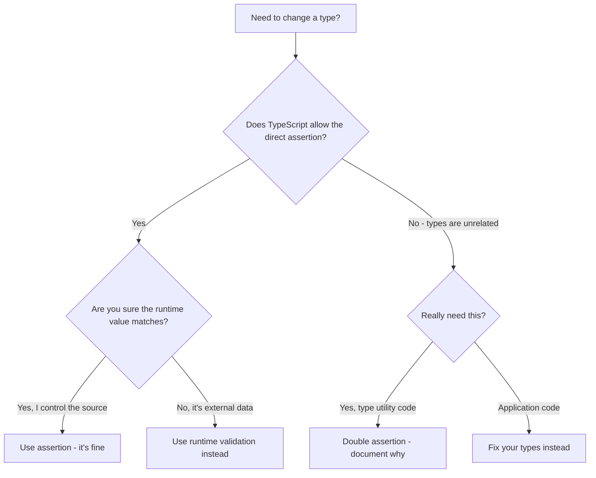

# TypeScript 'as' Keyword: Type Assertions Explained

You'll see the `as` keyword everywhere in TypeScript codebases. It's one of those features that's incredibly easy to use and incredibly easy to misuse. I've reviewed PRs where `as` was the right call, and I've reviewed PRs where it was papering over a real bug. Telling the difference is a core TypeScript skill.

Let's be clear about something upfront: **type assertions are not type casts.** If you come from Java or C#, that distinction matters a lot. A cast can transform a value at runtime. A TypeScript assertion does absolutely nothing at runtime  it's purely a compile-time instruction that says "treat this value as this type."

## What Type Assertions Actually Do

A **typescript type assertion** tells the compiler to treat a value as a specific type, overriding its inferred type:

```typescript
const input = document.getElementById("search");
// TypeScript thinks: HTMLElement | null

const searchInput = document.getElementById("search") as HTMLInputElement;
// Now TypeScript treats it as: HTMLInputElement
```

This is useful because `getElementById` returns `HTMLElement`, but you *know* that `#search` is an `<input>`. The assertion narrows the type so you can access input-specific properties like `.value`:

```typescript
// Without assertion  error
const el = document.getElementById("search");
console.log(el.value); // Error: Property 'value' does not exist on type 'HTMLElement'

// With assertion  works
const el = document.getElementById("search") as HTMLInputElement;
console.log(el.value); // Fine
```

There's also the older angle-bracket syntax, which does the same thing:

```typescript
const el = <HTMLInputElement>document.getElementById("search");
```

But this syntax conflicts with JSX, so if you're writing React (or any JSX), you have to use `as`. Most teams just standardize on `as` everywhere for consistency  I'd recommend the same.

## When Assertions Are Safe

Assertions are reasonable when you genuinely know more about a type than TypeScript can infer. Here are the common safe scenarios:

**DOM elements with known types:**

```typescript
const canvas = document.querySelector("canvas") as HTMLCanvasElement;
const ctx = canvas.getContext("2d"); // TypeScript now knows this is a canvas
```

**Event targets in handlers:**

```typescript
form.addEventListener("submit", (e) => {
  const formData = new FormData(e.target as HTMLFormElement);
});
```

**API responses you've already validated:**

```typescript
// You've validated the response shape upstream
const user = (await response.json()) as User;
```

But that last one is where things start getting shaky. Are you *really* sure the API response matches the `User` interface? What if the backend team added a field? What if a nullable field got sent as `null` when your interface says `string`? Assertions don't validate  they just trust.

> **Tip:** If you're asserting types on API responses, consider using a runtime validation library like Zod instead. It actually checks the data shape at runtime, not just at compile time.

## When Assertions Are Dangerous

Here's the pattern I see too often:

```typescript
interface User {
  id: number;
  name: string;
  email: string;
}

// This compiles fine  and will crash at runtime
const user = {} as User;
console.log(user.name.toUpperCase()); // Runtime: Cannot read property 'toUpperCase' of undefined
```

That `as User` told TypeScript "this empty object is a User." TypeScript believed you. The runtime didn't. You've just bypassed the type system entirely, and you'll find out about it when a customer hits that code path.

Another common misuse  asserting to silence errors you should fix:

```typescript
// Bad: assertion hides a real type incompatibility
const config = getConfig() as AppConfig;

// Better: investigate WHY getConfig() doesn't return AppConfig
// Maybe it returns Partial<AppConfig> and you need defaults
const config: AppConfig = {
  ...defaultConfig,
  ...getConfig()
};
```

## The Double Assertion Hack

TypeScript won't let you assert between completely unrelated types:

```typescript
const num = 42;
const str = num as string;
// Error: Conversion of type 'number' to type 'string' may be a mistake
```

But you can force it through `unknown` (or `any`):

```typescript
const num = 42;
const str = num as unknown as string; // No error. But also... no safety.
```

This is called the **double assertion** and it's a red flag in any codebase. It means "I know these types are unrelated but just let me do this." There are rare legitimate uses  some complex type utility patterns require it  but in application code, if you need a double assertion, something is wrong with your types.



## The `satisfies` Operator: A Better Alternative

TypeScript 4.9 introduced the `satisfies` operator, and it's replaced a lot of my `as` usage. The key difference: `satisfies` validates that an expression matches a type *without* changing the inferred type.

```typescript
type ColorMap = Record<string, [number, number, number]>;

// With 'as'  you lose specific key information
const colors = {
  red: [255, 0, 0],
  green: [0, 255, 0],
} as ColorMap;

colors.red;    // type: [number, number, number]
colors.purple; // No error  TypeScript only sees Record<string, ...>

// With 'satisfies'  you keep specific key information
const colors = {
  red: [255, 0, 0],
  green: [0, 255, 0],
} satisfies ColorMap;

colors.red;    // type: [number, number, number]
colors.purple; // Error: Property 'purple' does not exist
```

See the difference? With `as`, TypeScript forgets the specific keys and just sees a generic `Record`. With `satisfies`, TypeScript confirms the value matches `ColorMap` AND remembers that only `red` and `green` exist.

Here's a real-world example with configuration objects:

```typescript
type RouteConfig = {
  path: string;
  auth: boolean;
  roles?: string[];
};

// satisfies validates the shape without widening the type
const routes = {
  home: { path: "/", auth: false },
  dashboard: { path: "/dashboard", auth: true, roles: ["admin", "user"] },
  settings: { path: "/settings", auth: true, roles: ["admin"] },
} satisfies Record<string, RouteConfig>;

// TypeScript still knows the exact keys
routes.home.path;      // Works  TypeScript knows 'home' exists
routes.nonexistent;    // Error  TypeScript knows this key doesn't exist
```

| Feature | `as` (assertion) | `satisfies` (validation) |
|---------|-------------------|--------------------------|
| Validates type compatibility | Partially (allows widening) | Yes (strictly) |
| Changes inferred type | Yes (replaces it) | No (preserves it) |
| Catches extra properties | No | Yes |
| Catches missing properties | No | Yes |
| Works for narrowing types | Yes | Not its purpose |
| Introduced in | TypeScript 1.0 | TypeScript 4.9 |

My rule of thumb: use `satisfies` when you want to *validate* that a value matches a type. Use `as` when you need to *narrow* a type you already know is correct (like DOM elements). Reach for `as` a lot less than you think you need to.

## Assertions vs Type Guards: Know the Difference

Assertions override the compiler. Type guards *work with* the compiler. When possible, prefer type guards:

```typescript
// Assertion approach  trusting yourself
function processInput(val: string | number) {
  const str = val as string;
  return str.toUpperCase(); // Will crash if val is actually a number
}

// Type guard approach  proving to the compiler
function processInput(val: string | number) {
  if (typeof val === "string") {
    return val.toUpperCase(); // TypeScript KNOWS this is safe
  }
  return val.toFixed(2); // TypeScript KNOWS this is a number
}
```

The type guard version is safer and  here's the thing  it handles the `number` case too. Assertions tend to make you forget about the other branches.

## A Practical Guideline

Here's the heuristic I use for when to reach for `as`:

1. **First choice:** Can I narrow the type with a type guard? Do that.
2. **Second choice:** Can I use `satisfies` to validate? Do that.
3. **Third choice:** Do I genuinely know more than TypeScript about this specific value? Use `as`, and add a comment explaining why.
4. **Last resort:** Do I need a double assertion? Something is probably wrong. Fix the types if you can.

If you're converting JavaScript code to TypeScript and finding yourself adding `as` assertions everywhere just to get things compiling, that's a sign the types need more thought. [SnipShift's JS to TypeScript converter](https://snipshift.dev/js-to-ts) generates proper interfaces based on your actual code patterns, which means fewer assertions and better type safety out of the gate.

For more on making the most of TypeScript's type system, check out our guides on [interface vs type](/blog/typescript-interface-vs-type) and [TypeScript generics](/blog/typescript-generics-explained). And if you're coming from JavaScript and want the full migration picture, our [TypeScript migration strategy](/blog/typescript-migration-strategy) covers the process end to end.
