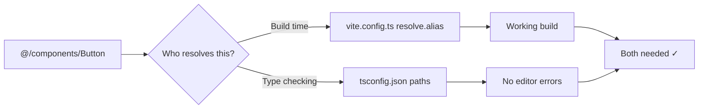

# How to Set Up Path Aliases in Vite with TypeScript (@/ Imports)

Every single Vite project I start, I do this setup within the first five minutes. Because nothing makes me twitch like seeing `import { Button } from '../../../../components/ui/Button'` in a codebase. And yet, I've Googled "vite path aliases typescript" more times than I'd like to admit  because there are two config files that need to agree, and getting one wrong gives you confusing errors.

Here's the setup I use. Takes about two minutes.

## The Problem: Two Configs That Must Agree

Vite uses `vite.config.ts` for bundling. TypeScript uses `tsconfig.json` for type checking. Path aliases need to be defined in **both**, and they need to match. If you only configure one, you'll get either build errors or red squiggles in your editor  and neither error message will tell you what's actually wrong.



## Option 1: Manual Configuration (No Plugin)

### Step 1: Update vite.config.ts

```typescript
// vite.config.ts
import { defineConfig } from "vite";
import react from "@vitejs/plugin-react";
import path from "path";

export default defineConfig({
  plugins: [react()],
  resolve: {
    alias: {
      "@": path.resolve(__dirname, "./src"),
    },
  },
});
```

That tells Vite's bundler: "When you see `@/anything`, look in `./src/anything`."

### Step 2: Update tsconfig.json

```json
{
  "compilerOptions": {
    "baseUrl": ".",
    "paths": {
      "@/*": ["./src/*"]
    }
  }
}
```

Both `baseUrl` and `paths` are required. I've seen people add `paths` without `baseUrl` and wonder why nothing works  TypeScript silently ignores `paths` if `baseUrl` isn't set. Kind of annoying, honestly.

> **Warning:** If you're using Vite's default template, your `tsconfig.json` might split config across `tsconfig.json`, `tsconfig.app.json`, and `tsconfig.node.json`. Add the `paths` to the one that covers your source code  usually `tsconfig.app.json`. Check the `"include"` field to be sure.

### Step 3: Use It

Now you can write imports like:

```typescript
import { Button } from "@/components/ui/Button";
import { useAuth } from "@/hooks/useAuth";
import { formatDate } from "@/lib/utils";
import type { User } from "@/types";
```

Instead of the deeply nested relative path nightmare. Your editor autocomplete should work too  hit Ctrl+Space after `@/` and see your `src` directory.

## Option 2: The vite-tsconfig-paths Plugin (Less Config)

If maintaining aliases in two places bugs you  and it bugged me enough to find a better way  there's a plugin that reads your `tsconfig.json` paths and applies them to Vite automatically:

```bash
npm install -D vite-tsconfig-paths
```

```typescript
// vite.config.ts
import { defineConfig } from "vite";
import react from "@vitejs/plugin-react";
import tsconfigPaths from "vite-tsconfig-paths";

export default defineConfig({
  plugins: [react(), tsconfigPaths()],
});
```

Now you **only** need to define paths in `tsconfig.json`  the plugin handles the Vite side. One source of truth. I've been using this approach on my last few projects and haven't looked back.

| Approach | Pros | Cons |
|----------|------|------|
| Manual (resolve.alias) | No extra dependency, explicit | Two files to maintain, easy to desync |
| vite-tsconfig-paths plugin | Single source of truth, less config | Extra dev dependency, plugin must stay updated |

For solo projects or small teams, the plugin is a no-brainer. For large projects with strict dependency policies, the manual approach works fine  just make sure someone documents it.

## Multiple Aliases

You're not limited to just `@`. Some projects use multiple aliases for different concerns:

```json
{
  "compilerOptions": {
    "baseUrl": ".",
    "paths": {
      "@/*": ["./src/*"],
      "@components/*": ["./src/components/*"],
      "@lib/*": ["./src/lib/*"],
      "@hooks/*": ["./src/hooks/*"]
    }
  }
}
```

I personally just use `@/*` and call it done. The extra granularity isn't worth the cognitive overhead for most projects. But if your `src` directory has 20+ top-level folders, more specific aliases can help.

## Common Issues and Fixes

**"Cannot find module '@/...'" in your editor but the build works fine**  Your tsconfig.json is missing the paths config. Or you edited the wrong tsconfig file (check if there's a `tsconfig.app.json` that Vite actually uses).

**Build works but tests fail**  If you're using Vitest, it picks up Vite's config automatically. But if you're using Jest, you'll need `moduleNameMapper` in your Jest config:

```javascript
// jest.config.js
module.exports = {
  moduleNameMapper: {
    "^@/(.*)$": "<rootDir>/src/$1",
  },
};
```

**TypeScript complains about `path` module**  Add `"node"` to your `types` in tsconfig, or install `@types/node`:

```bash
npm install -D @types/node
```

If you're working with TypeScript config files and want to quickly generate types from your JSON configs, [SnipShift's JSON to TypeScript converter](https://snipshift.dev/json-to-typescript) can help  especially useful when you're typing complex Vite plugin options.

For more on TypeScript path configuration, our [tsconfig paths and import alias guide](/blog/tsconfig-paths-import-alias) goes deeper into the TypeScript side of things. And if you're setting up a brand new project, our [ESLint + Prettier + TypeScript setup guide](/blog/eslint-prettier-typescript-setup) covers the rest of the DX essentials.

## That's It

Two minutes of config, zero `../../..` imports for the rest of the project's life. Whether you go manual or use the plugin, the important thing is doing this early  retrofitting path aliases into an existing codebase means updating every import, which is exactly as tedious as it sounds. Set it up on day one and forget about it.

Check out more developer tools and converters at [SnipShift](https://snipshift.dev)  we build the little utilities that save you time on exactly this kind of setup work.
