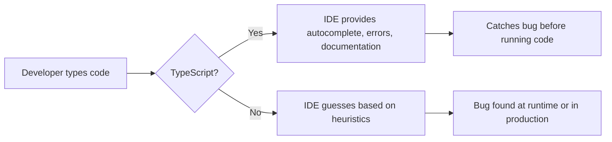

# Why Every JavaScript Project Should Adopt TypeScript in 2026

Hot take: if your team is still debating whether to adopt TypeScript in 2026, the debate is already over. The JavaScript ecosystem has collectively made its decision, and TypeScript won. Not because it's trendy, not because some influencer said so, but because it solves real problems that every team hits eventually.

I've been writing TypeScript since 2019, and I've watched it go from "that thing Angular uses" to the default choice for basically every serious JavaScript project. And I say this as someone who resisted the switch for about a year because I thought it was "just extra syntax for no real benefit." I was wrong. Here's why use TypeScript  and why 2026 is genuinely the year where the excuses have run out.

## The IDE Experience Is Transformative

This is the #1 reason developers who try TypeScript don't go back. And it's kind of hard to explain until you've experienced it.

In a JavaScript file, your IDE is guessing. It's doing its best with JSDoc comments and inference, but it's guessing. In TypeScript, your IDE knows. It knows the shape of every object, the parameters of every function, the return type of every API call.

What that means in practice:

- **Autocomplete that actually works.** You type `user.` and see every property  `name`, `email`, `role`, `createdAt`  with their types. No more switching to another file to check what properties exist.
- **Instant error detection.** You pass a `number` where a `string` is expected? Red squiggly line, right there, before you even save the file.
- **Safe refactoring.** Rename a function and your IDE updates every single call site. In JavaScript, it might miss some because it's not sure if `getData` in file A is the same `getData` in file B. In TypeScript, it knows.
- **Hover documentation.** Hover over any variable and see its type. Hover over a function and see its full signature. It's like having documentation embedded in your code.

I timed myself once  before and after TypeScript  on a typical day of feature work. The TypeScript version saved me roughly 25 minutes of context-switching between files to look up function signatures and object shapes. Multiply that across a team of 8 developers over a year and you're looking at hundreds of hours.



## You'll Catch Bugs Before Your Users Do

Let me tell you about a bug that cost my last team three days of debugging. A function expected a user ID as a string. Somewhere deep in the codebase, someone was passing a number. JavaScript happily coerced it, and everything worked  except for one edge case where the ID started with a zero and the number representation dropped it.

TypeScript would've caught that at compile time. One red squiggly line. Zero debugging time.

This isn't an unusual story. The types of bugs TypeScript catches are exactly the types of bugs that are hardest to track down at runtime:

- Passing the wrong type to a function
- Accessing a property that doesn't exist on an object
- Forgetting to handle `null` or `undefined`
- Misspelling a property name
- Calling a function with the wrong number of arguments
- Using the wrong key in a discriminated union

A study by Airbnb found that 38% of the bugs they looked at could have been prevented by TypeScript. That's not a marginal improvement  that's a fundamental shift in how many bugs make it to production.

> **Tip:** The real value isn't just catching bugs. It's the *confidence* TypeScript gives you. When the compiler says your code is correct, you can trust it. In JavaScript, the only way to know your code works is to run it  every path, every edge case. That's impossible to do manually.

## Documentation That Never Gets Stale

We've all seen it. The JSDoc comment that says `@param {Object} options` and then lists three properties  but the function actually accepts seven. The README that shows the API signature from two versions ago. The Confluence page that nobody's updated since Q2 of last year.

TypeScript types *are* documentation, and they're always accurate because the compiler enforces them.

```typescript
// This IS the documentation. And it's always up to date.
interface CreateUserOptions {
  email: string;
  displayName: string;
  role?: 'admin' | 'editor' | 'viewer';
  sendWelcomeEmail?: boolean;
  metadata?: Record<string, string>;
}

async function createUser(options: CreateUserOptions): Promise<User> {
  // ...
}
```

When a new developer joins your team, they don't need to read a wiki page to understand what `createUser` accepts. They just look at the type. Or more accurately, their IDE shows them the type automatically when they start typing `createUser(`.

I've worked on teams where onboarding a new developer to the codebase took two weeks. After migrating to TypeScript, that dropped to about four days. Not because TypeScript is magic, but because the codebase became self-documenting.

## The Hiring Signal

This might be controversial, but I've seen it play out enough times to believe it: teams that use TypeScript tend to attract better developers. Not because TypeScript developers are inherently better  but because choosing TypeScript signals that the team cares about code quality, has engineering standards, and invests in developer experience.

When I'm looking at job postings, a TypeScript codebase tells me the team has thought about tooling. A JavaScript codebase doesn't tell me anything negative necessarily  but a TypeScript one tells me something positive.

From the hiring side, listing TypeScript in your job posting does three things:

1. **Filters for developers who value type safety.** These tend to be developers who think carefully about code.
2. **Signals that your codebase is modern.** Developers want to work on modern stacks.
3. **Reduces onboarding time.** New hires can understand the codebase faster because of the built-in type documentation.

I'm not saying JavaScript projects can't attract great talent. Of course they can. But in a competitive hiring market, every signal matters.

## The Ecosystem Is Fully Mature

Three or four years ago, you could argue that TypeScript's ecosystem had gaps. Some popular libraries didn't have types. Some frameworks had rough TypeScript support. That argument doesn't hold up anymore.

As of 2026:

- **React** has first-class TypeScript support and the community recommends it as the default
- **Next.js** generates TypeScript configurations out of the box
- **Node.js** natively supports running `.ts` files (as of Node 22 with `--experimental-strip-types`, stabilized in later versions)
- **Deno** and **Bun** support TypeScript natively with zero configuration
- **Vite**, **esbuild**, and **SWC** all handle TypeScript with essentially no build time overhead
- **DefinitelyTyped** has types for over 10,000 packages
- **Most major libraries** now ship with their own type definitions

The "but I don't want to deal with build configuration" argument is dead. Create a new project with any modern framework and TypeScript just works. There's no separate compilation step that adds 30 seconds to your build. Tools like esbuild and SWC strip types so fast you don't even notice they're there.

| Framework/Runtime | TypeScript Support | Setup Required |
|---|---|---|
| Next.js | Built-in | Zero config (`create-next-app --ts`) |
| Vite + React | Built-in | Zero config (select TS template) |
| Node.js 22+ | Native (experimental) | `--experimental-strip-types` flag |
| Bun | Native | Zero config |
| Deno | Native | Zero config |

## Refactoring Without Fear

This is the one that sealed the deal for me personally. I was working on a project where we needed to change the shape of our `User` object  adding a new required field and renaming another. In a JavaScript codebase, that change would've been terrifying. You'd grep for every usage, manually check each one, cross your fingers, and hope your tests covered everything.

In TypeScript, I changed the interface and hit save. The compiler immediately showed me every single file that needed to be updated. I fixed them one by one, ran the tests, and shipped with absolute confidence that nothing was missed.

```typescript
// Before
interface User {
  name: string;
  email: string;
}

// After  added 'displayName', renamed nothing, but added required 'avatarUrl'
interface User {
  name: string;
  displayName: string;   // new required field
  email: string;
  avatarUrl: string;     // new required field
}

// TypeScript immediately flags every place where a User is created
// without 'displayName' and 'avatarUrl'. Every. Single. One.
```

The bigger your codebase, the more valuable this becomes. On small projects, you can kind of get away with grep-and-pray refactoring. On a 100,000-line codebase with 15 developers? You need the compiler watching your back.

## "But TypeScript Slows Me Down"

I hear this from developers who haven't used TypeScript in a while, or who tried it briefly and bounced off. And honestly? The first week or two, yes, it does slow you down. You're fighting the compiler, looking up types, figuring out generics.

But after that initial ramp-up, TypeScript makes you faster. Not a little faster  significantly faster. Because:

- You stop switching files to check function signatures
- You stop running the app to test if something works
- You stop debugging type-related runtime errors
- You stop reading outdated documentation
- Your refactoring is automated instead of manual

The initial friction is real. But it's a one-time cost that pays for itself within a few weeks.

If the learning curve is what's holding you back, try this: take a single JavaScript file from your project and convert it to TypeScript. See what the types look like. [SnipShift's JS to TypeScript converter](https://snipshift.dev/js-to-ts) can do this instantly  paste your JS, see the typed version. It's a good way to demystify what TypeScript actually adds to your code.

## The Excuses Are Gone

Let me address the remaining objections:

**"We don't have time to migrate."** You don't need to migrate all at once. TypeScript supports incremental adoption. Add it to new files, convert old files when you touch them. Our [5-step migration strategy](/blog/typescript-migration-strategy) shows you how.

**"Our team doesn't know TypeScript."** If they know JavaScript, they know 90% of TypeScript. The learning curve for basic usage is a few days at most. Advanced features like generics and conditional types can come later.

**"It adds build complexity."** Not anymore. Modern tools strip types so fast it's imperceptible. And if you're using Node 22+, Bun, or Deno, there's no build step at all.

**"We have great test coverage instead."** Types and tests catch different things. Types catch structural errors at compile time. Tests catch behavioral errors at runtime. They're complementary, not alternatives. And frankly, typed code is easier to test because the contracts are explicit.

## The Bottom Line

Why use TypeScript? Because in 2026, there's no good reason not to. The tooling is mature. The ecosystem is there. The developer experience improvement is massive. The bug prevention is real. And the migration path is well-documented and incremental.

The teams that adopted TypeScript early are now reaping years of compound benefits  faster onboarding, easier refactoring, fewer production incidents, better tooling. The teams that adopt it now will catch up quickly. The teams that keep waiting... well, they'll keep spending time on bugs that TypeScript would've caught for free.

If you want to see what TypeScript looks like for your code specifically, [try the converter](https://snipshift.dev/js-to-ts). And when you're ready to start the migration, our [complete guide to converting JavaScript to TypeScript](/blog/convert-javascript-to-typescript) has everything you need.

The debate is over. The types have won.
