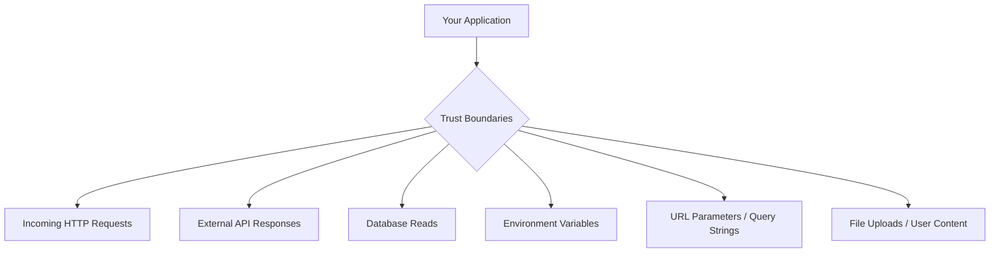

# How to Use Zod for Runtime Validation at API Boundaries

TypeScript gives you type safety at compile time. But compile time and runtime are two very different things. Your beautifully typed `User` interface means nothing when the data coming in from an HTTP request, a third-party API, or a database query doesn't match what you expected.

I learned this the hard way on a project where we trusted that an external API would always return a `createdAt` field as an ISO string. It did  for six months. Then one day it started returning a Unix timestamp. Our code didn't crash immediately. It just silently passed a number through a string formatter, produced garbage dates in the UI, and we didn't notice until a customer support ticket.

That's the problem **Zod runtime validation** solves. Not in the middle of your business logic  at the **boundaries** of your application, where data enters or leaves your system.

## Where to Actually Validate

Most Zod tutorials show you `z.string()` and `z.object()` and call it a day. The more useful question is *where* you put those schemas. Here's my rule: validate at every trust boundary.



Inside your application  between your own functions, your own modules  you don't need runtime validation. TypeScript handles that. But at every edge where data crosses a trust boundary, you should validate.

Let me walk through each one.

## Validating Incoming API Requests

This is the obvious one. When a client sends a POST request, you need to verify the body matches your expected shape before doing anything with it.

```typescript
import { z } from 'zod';

const CreateOrderSchema = z.object({
  items: z.array(
    z.object({
      productId: z.string().uuid(),
      quantity: z.number().int().positive().max(99),
    })
  ).min(1).max(50),
  shippingAddress: z.object({
    street: z.string().min(1).max(200),
    city: z.string().min(1).max(100),
    zip: z.string().regex(/^\d{5}(-\d{4})?$/),
    country: z.string().length(2), // ISO 3166-1 alpha-2
  }),
  couponCode: z.string().optional(),
});

type CreateOrderInput = z.infer<typeof CreateOrderSchema>;
```

The `z.infer` utility is key here  it extracts the TypeScript type from the schema, so you define the shape once and get both runtime validation and compile-time types.

If you have existing JSON payloads and want to quickly generate Zod schemas from them, [SnipShift's JSON to Zod converter](https://snipshift.dev/json-to-zod) saves a lot of manual typing. Paste in a sample API payload, get a schema back.

## parse vs safeParse  Pick the Right One

Zod gives you two ways to validate:

```typescript
// Throws ZodError on failure  use when invalid data is a bug
const order = CreateOrderSchema.parse(requestBody);

// Returns { success, data, error }  use when invalid data is expected
const result = CreateOrderSchema.safeParse(requestBody);
if (!result.success) {
  return res.status(400).json(formatErrors(result.error));
}
const order = result.data;
```

**Use `parse`** when invalid data means something is genuinely wrong  a programming error, a corrupted database record, a broken contract. You want the exception to surface.

**Use `safeParse`** when invalid data is expected and you need to handle it gracefully  user input, form submissions, external API responses. This is what you'll use 90% of the time at API boundaries.

I see teams get this wrong both ways. Using `parse` on user input means unhandled exceptions in your request handler. Using `safeParse` on internal data means swallowing errors that should crash loudly.

## Building Validation Middleware

Instead of calling `safeParse` in every route handler, create middleware that handles it once:

```typescript
// Express-style middleware
import { z, ZodSchema } from 'zod';
import { Request, Response, NextFunction } from 'express';

function validate<T extends ZodSchema>(schema: T) {
  return (req: Request, res: Response, next: NextFunction) => {
    const result = schema.safeParse(req.body);
    if (!result.success) {
      return res.status(400).json({
        error: 'Validation failed',
        issues: result.error.issues.map((issue) => ({
          path: issue.path.join('.'),
          message: issue.message,
        })),
      });
    }
    // Attach validated data  now it's typed
    req.body = result.data;
    next();
  };
}

// Usage
app.post('/orders', validate(CreateOrderSchema), (req, res) => {
  // req.body is now typed as CreateOrderInput
  const order = req.body;
  // ... handle order
});
```

If you're using Hono, the `@hono/zod-validator` package does exactly this  check out our [Hono.js TypeScript API guide](/blog/build-api-hono-typescript) for the setup.

## Validating External API Responses

This is the one most teams skip, and it's the one that bites hardest. When you call a third-party API, you're trusting that the response matches their documentation. That trust is misplaced.

```typescript
const GitHubUserSchema = z.object({
  login: z.string(),
  id: z.number(),
  avatar_url: z.string().url(),
  name: z.string().nullable(),
  email: z.string().email().nullable(),
  public_repos: z.number(),
});

type GitHubUser = z.infer<typeof GitHubUserSchema>;

async function getGitHubUser(username: string): Promise<GitHubUser> {
  const response = await fetch(`https://api.github.com/users/${username}`);
  const data = await response.json();

  // Validate the response  don't trust the external API
  return GitHubUserSchema.parse(data);
}
```

When GitHub changes their API response (adds a field, changes a type, deprecates something), your Zod schema catches it immediately with a clear error message instead of producing undefined behavior downstream.

> **Warning:** Don't validate the *entire* API response if you only use a few fields. Use `z.object({...}).passthrough()` or `z.object({...}).strip()` to be lenient about extra fields while strict about the ones you depend on.

## Validating Environment Variables

This is one of my favorite Zod patterns. Instead of accessing `process.env.DATABASE_URL` directly and hoping it's there, validate all your env vars at startup:

```typescript
// src/env.ts
import { z } from 'zod';

const EnvSchema = z.object({
  DATABASE_URL: z.string().url(),
  API_KEY: z.string().min(1),
  PORT: z.coerce.number().int().positive().default(3000),
  NODE_ENV: z.enum(['development', 'staging', 'production']).default('development'),
  REDIS_URL: z.string().url().optional(),
  LOG_LEVEL: z.enum(['debug', 'info', 'warn', 'error']).default('info'),
});

// Parse at startup  crash early if config is wrong
export const env = EnvSchema.parse(process.env);

// Usage anywhere: env.DATABASE_URL (typed as string, guaranteed to exist)
```

If `DATABASE_URL` is missing or `PORT` isn't a valid number, your app crashes on startup with a clear message. Not after the first request hits a database call. Not in production at 2am. At startup, with a readable error.

The `z.coerce.number()` trick handles the fact that environment variables are always strings. It coerces `"3000"` to `3000` automatically.

For more on managing env files across environments, see our [guide to managing multiple .env files](/blog/manage-multiple-env-files).

## Validating URL Parameters and Query Strings

URL params are strings. Always. Even if they represent numbers. Zod's coercion handles this elegantly:

```typescript
const PaginationSchema = z.object({
  page: z.coerce.number().int().positive().default(1),
  limit: z.coerce.number().int().min(1).max(100).default(20),
  sortBy: z.enum(['createdAt', 'updatedAt', 'name']).default('createdAt'),
  order: z.enum(['asc', 'desc']).default('desc'),
});

// In your route handler
const query = PaginationSchema.safeParse(req.query);
if (!query.success) {
  return res.status(400).json({ error: 'Invalid query parameters' });
}

const { page, limit, sortBy, order } = query.data;
// page is number, sortBy is "createdAt" | "updatedAt" | "name"  fully typed
```

No more `parseInt(req.query.page as string) || 1` scattered across your codebase.

## Error Formatting for API Consumers

Zod's default error format is verbose and nested. Your API consumers don't need to understand Zod internals. Here's a formatter that produces clean, frontend-friendly errors:

```typescript
import { ZodError } from 'zod';

function formatValidationError(error: ZodError) {
  return {
    error: 'Validation failed',
    details: error.issues.map((issue) => ({
      field: issue.path.join('.'),
      message: issue.message,
      code: issue.code,
    })),
  };
}

// Output looks like:
// {
//   "error": "Validation failed",
//   "details": [
//     { "field": "items.0.quantity", "message": "Number must be greater than 0", "code": "too_small" },
//     { "field": "shippingAddress.zip", "message": "Invalid", "code": "invalid_string" }
//   ]
// }
```

The `field` path uses dot notation (`items.0.quantity`), which most frontend form libraries can map directly to field-level error messages.

> **Tip:** If you're using React Hook Form on the frontend, Zod integrates directly via `@hookform/resolvers/zod`. Same schema validates on both server and client  write it once, share it.

For a broader look at how to structure API error responses so your frontend can actually use them, our [API error handling guide](/blog/handle-api-errors-javascript) covers the full pattern.

## The Mental Model

Here's how I think about **Zod runtime validation at API boundaries**:

| Boundary | Validation Style | On Failure |
|----------|-----------------|------------|
| Incoming request body | `safeParse` | Return 400 with field errors |
| URL params / query | `safeParse` | Return 400 with defaults or errors |
| External API response | `parse` (or `safeParse` + log) | Throw/alert  the contract is broken |
| Environment variables | `parse` | Crash at startup  fail fast |
| Database reads | Usually skip | Trust your ORM's types |

Inside those boundaries, trust TypeScript. Don't re-validate data that your own code produced. The goal isn't to validate everything everywhere  it's to validate at the seams where your code meets the outside world.

**Zod runtime validation** isn't about being paranoid. It's about being precise about where you trust data and where you verify it. Get the boundaries right, and the inside of your application stays clean, typed, and simple. Get them wrong, and you're debugging mysterious undefined values at 3am.
